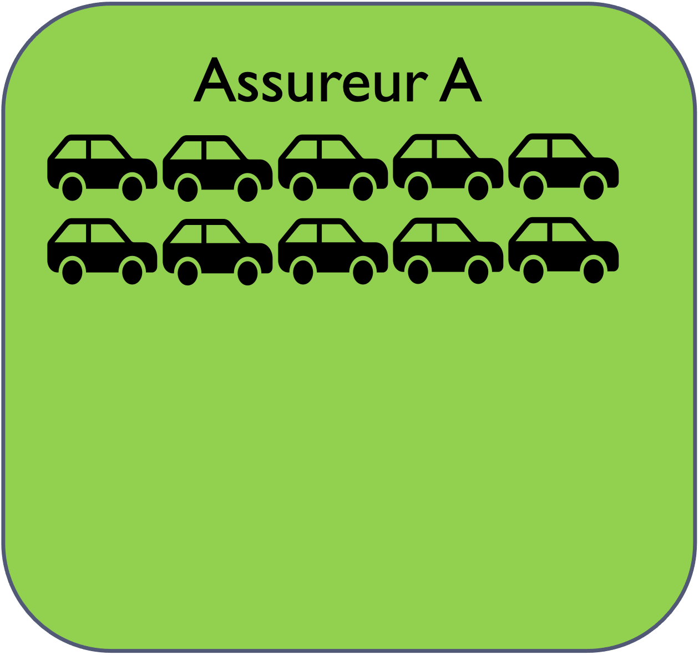
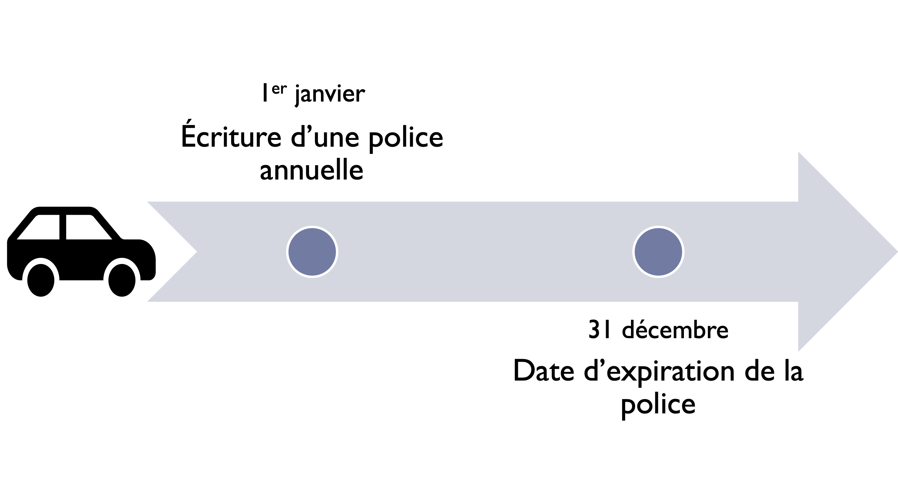
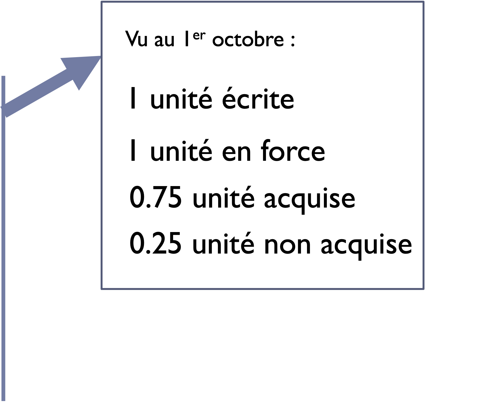
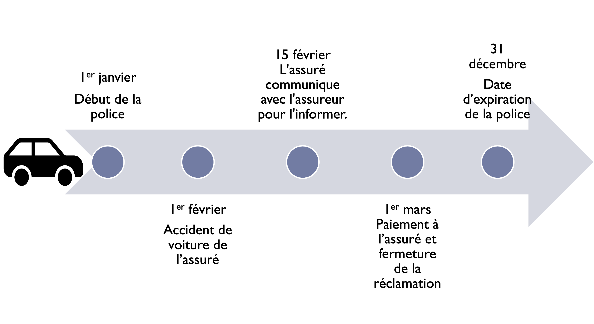
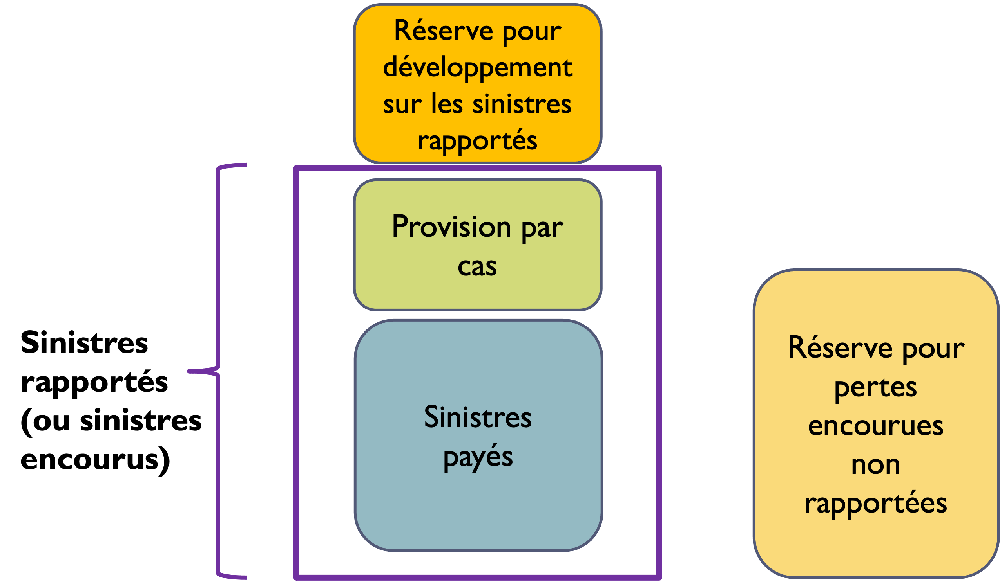
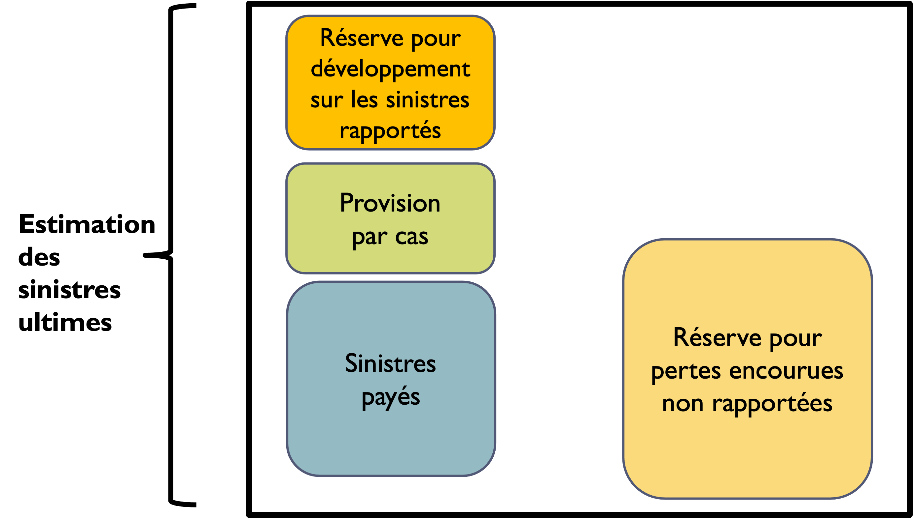

---
format:
  revealjs: default
chapter-css: diapos.css
metadata-files:
  - ../_diapos.yml
---

## Lectures recommandées

Ce chapitre est adapté du chapitre 1 du texte *Basic Ratemaking* :

[Werner, G. et Modlin, C. (2016). *Basic Ratemaking*, Casualty Actuarial Society, Fifth Edition](http://www.casact.org/library/studynotes/Werner_Modlin_Ratemaking.pdf)

## Contenu du chapitre {.progress-overview}

# Relation prix / coût / profit {data-progress-label="Prix" subtitle="Pourquoi l’assurance ne se tarifie pas comme un produit ordinaire"}

## {.card-fill}

::: {.card-fill-content}
{fig-alt="Tasse de café illustrant un produit dont le prix couvre un coût connu et une marge de profit."}
:::

::: {.absolute .card-fill-caption bottom=18 left=0 width="100%"}
Image : https://pixabay.com/fr/starbucks-tasse-café-belle-macro-2346226/
:::

::: {.notes}
Exemple d’un bien de consommation :

Dans le prix d’un latte au Starbucks, par exemple 5 $, il y a une portion qui sert à couvrir les frais de production du café, par exemple : grains de café, l’employé qui sert au comptoir, les locaux, etc. (ex. : 4 $) et il y a une portion pour le profit (ex. : 1 $).
:::

## Prix

$$
\text{Prix} = \text{Coût} + \text{Profit}
$$

- Pour la plupart des biens et services autres que l’assurance, le coût est connu d’avance. On peut donc établir le prix afin d’atteindre le profit désiré par unité vendue

- Un produit d’assurance est différent : c’est une promesse d’indemniser l’assuré dans le futur si un événement couvert survient durant une période donnée

---

$$
\text{Prix} = \textbf{Coût} + \text{Profit}
$$

Le coût ultime d’une police n’est pas connu au moment de la vente.

::: {.notes}
Ex : si un assureur vend une police à un jeune conducteur qui vient d’acheter une voiture de 20 000 $, il ne connaît pas d’avance le coût de cette police. Il pourrait n’y avoir aucune perte, une perte partielle de 2 000 $, ou une perte totale de 20 000 $.
:::

## Prime

- Le prix d’une police d’assurance est une **prime d’assurance**.
- La prime d’un risque varie significativement selon les caractéristiques du risque.
- Le manuel de tarification contient l’information nécessaire pour classifier chaque risque et calculer la prime associée.

# Définitions des termes de base en assurance {data-progress-label="Termes de base" subtitle="Unité d'exposition, prime, réclamation, sinistre, frais et profit"}

## Unité d’exposition {.english-subtitle subtitle="Exposure"}

::: {.columns}
::: {.column width="50%"}
{width=100% fig-alt="Assureur couvrant un portefeuille de dix véhicules."}
:::

::: {.column width="50%"}
{width=100% fig-alt="Assureur couvrant un portefeuille de trente véhicules."}
:::
:::

---

::: {.columns}
::: {.column width="50%"}
{.act-muted-image width=100% fig-alt="Assureur couvrant un portefeuille de dix véhicules, affiché en retrait."}
:::

::: {.column width="50%"}
{.act-muted-image width=100% fig-alt="Assureur couvrant un portefeuille de trente véhicules, affiché en retrait."}
:::
:::

::: {.absolute .slide-callout top="52%" left="50%" width="65%"}
L’unité d’exposition sert de base pour le calcul de la prime d’assurance et mesure l’exposition aux sinistres d’une police.
:::

---

L’unité d’exposition varie par type d’assurance et secteur d’activité :

- Assurance automobile : un véhicule assuré pour une année
- Assurance habitation : une maison assurée pour une année
- Assurance responsabilité civile des entreprises : recettes annuelles

---

::: {.r-stack}
{width=100% fig-alt="Ligne du temps d'une police annuelle."}

{.fragment .unite-exposition-overlay width=40% fig-alt="Annotations montrant différentes mesures des unités d'exposition au 1er octobre."}
:::

::: {.notes}
Cet exemple simple illustre les différentes façons de mesurer les unités d’exposition. Les unités écrites proviennent des polices écrites dans l’année; les unités en force sont sujettes à une perte à un moment donné; les unités acquises correspondent à la portion déjà fournie; les unités non acquises correspondent à la portion qui n’a pas encore été fournie. Le chapitre 4 couvrira ce concept plus en détail.
:::

---

**Unités écrites** *(Ang. : Written exposures)*  
: Unités d’exposition provenant des polices écrites durant une période déterminée, par exemple un trimestre ou une année de calendrier.

**Unités en force** *(Ang. : In-force exposures)*  
: Unités qui sont sujettes à une perte à un certain moment dans le temps.

---

**Unités acquises** *(Ang. : Earned exposures)*  
: Portion des unités écrites pour laquelle la couverture a déjà été fournie à une certaine date.

**Unités non acquises** *(Ang. : Unearned exposures)*  
: Portion des unités écrites pour laquelle la couverture n’a pas encore été fournie à une certaine date.

## Prime {.english-subtitle subtitle="Premium"}

Montant payé par l’assuré pour la couverture d’assurance.

**Primes écrites** *(Ang. : Written premium)*  
: Primes associées aux polices écrites durant une période déterminée.

**Primes en force** *(Ang. : In-force premium)*  
: Prime totale du terme des polices qui sont en vigueur à une certaine date.

---

**Primes acquises** *(Ang. : Earned premium)*  
: Portion des primes écrites pour laquelle la couverture a déjà été fournie à une certaine date.

**Primes non acquises** *(Ang. : Unearned premium)*  
: Portion des primes écrites pour laquelle la couverture n’a pas encore été fournie à une certaine date.

## Réclamation {.english-subtitle subtitle="Claim" .reclamation-arrows}

{.nostretch width=90% fig-alt="Frise chronologique d'une réclamation avec statuts de la réclamation."}

::: {.fragment .fade-in .absolute .status-arrow .status-top .range-bounded .text-scale top="16%" left="29.4%" width="18%" scale="0.8"}
Perte survenue non rapportée
:::

::: {.fragment .fade-in .absolute .status-arrow .status-top .range-forward .text-scale top="16%" left="46%" width="35%" scale="0.8"}
Réclamation rapportée
:::

::: {.fragment .fade-in .absolute .status-arrow .status-bottom .range-bounded .text-scale top="85%" left="46.3%" width="16%" scale="0.8"}
Réclamation ouverte
:::

::: {.fragment .fade-in .absolute .status-arrow .status-bottom .range-forward .text-scale top="85%" left="61%" width="20%" scale="0.8"}
Réclamation fermée
:::

::: {.notes}
La réclamation devient rapportée lorsque l’assureur connaît le sinistre. Elle est ouverte entre la date rapportée et la fermeture, puis fermée lorsque le dossier est réglé.
:::

---

Demande d’indemnisation par le demandeur, soit l’assuré ou un tiers, pour un sinistre couvert par la police d’assurance.

**Date de sinistre ou date d’accident** *(Ang. : Date of loss, Accident date, or Occurrence date)*  
: Date de l’événement causant la perte.

**Date rapportée** *(Ang. : Report date)*  
: Date à laquelle l’assuré rapporte le sinistre à l’assureur.

---

**Perte encourue non rapportée** *(Ang. : Incurred but not reported claim, IBNR claim)*
: Perte survenue mais non connue par l’assureur.

**Réclamation rapportée** *(Ang. : Reported claim)*  
: Perte survenue et connue de l’assureur.

---

**Réclamation ouverte** *(Ang. : Open claim)*  
: Entre la date rapportée et la date de fermeture, la réclamation est considérée ouverte.

**Réclamation fermée** *(Ang. : Closed claim)*  
: Lorsque la réclamation est réglée, elle est considérée fermée.

## Sinistre {.english-subtitle subtitle="Loss"}

Plusieurs termes en lien avec les sinistres :

{width=92% fig-alt="Découpage des sinistres montrant les sinistres payés, la provision par cas, la réserve pour développement sur les sinistres rapportés et la réserve pour pertes encourues non rapportées."}

::: {.notes}
Cette figure présente le découpage des sinistres. Les sinistres rapportés regroupent les sinistres payés et la provision par cas. La réserve pour développement sur les sinistres rapportés représente l’estimation additionnelle sur ces sinistres rapportés. La réserve IBNR correspond aux pertes encourues non rapportées.
:::

---

Plusieurs termes en lien avec les sinistres :

{width=92% fig-alt="Découpage des sinistres servant à l'estimation des sinistres ultimes avec sinistres payés, provision par cas, réserve pour développement sur les sinistres rapportés et réserve pour pertes encourues non rapportées."}

::: {.notes}
L’estimation des sinistres ultimes combine les sinistres rapportés, la réserve pour pertes encourues non rapportées et la réserve pour le développement sur les sinistres rapportés.
:::

---

Montant payé ou payable au demandeur sous les termes de la police d’assurance.

**Sinistres payés** *(Ang. : Paid losses)*  
: Montant déjà payé à l’assuré ou tiers.

**Provision par cas** *(Ang. : Case reserve)*  
: Estimation du montant à être payé pour régler une réclamation rapportée.

  - Exclut les sinistres déjà payés pour cette réclamation
  - Ajustée lorsque de l’information supplémentaire sur la réclamation est disponible et lorsque des paiements sont faits

---

**Sinistres rapportés ou encourus** *(Ang. : Reported losses or case incurred losses)*  

$$
\text{Sinistres rapportés}
= \text{Sinistres payés} + \text{Provision par cas}
$$

---

**Sinistres ultimes**  
: Montant total requis pour régler une réclamation.

**Réserve pour pertes encourues non rapportées** *(Ang. : Incurred but not reported (IBNR) reserve)*  
: Estimation du montant requis pour régler les pertes encourues non rapportées.

**Réserve pour le développement sur les sinistres rapportés** *(Ang. : Incurred but not enough reported (IBNER) reserve)*   
: Différence entre les sinistres rapportés au moment de l’évaluation des sinistres et le montant total estimé pour ultimement régler ces pertes rapportées.

---

$$
\begin{aligned}
&\text{Estimation des sinistres ultimes} = \\ \\
&\text{Sinistres rapportés } + \\
&\text{Réserve pour pertes encourues non rapportées (\textit{IBNR}) } + \\
&\text{Réserve pour le développement sur les sinistres rapportés (\textit{IBNER})}
&\end{aligned}
$$

## Frais de règlement de sinistre {.english-subtitle subtitle="Loss Adjustment Expenses"}

**Frais de règlement de sinistre** *(Ang. : Loss adjustment expenses)*  
: Frais encourus dans le processus de règlement des sinistres.

**Alloués** *(Ang. : Allocated loss adjustment expenses)*  
: Frais de règlement de sinistre attribuables à une réclamation spécifique.  
  Ex : frais d’avocats externes engagés pour défendre une réclamation.

**Non alloués** *(Ang. : Unallocated loss adjustment expenses)*  
: Frais de règlement de sinistre qui ne sont pas attribuables à une réclamation spécifique.  
Ex : salaire du personnel du département de sinistres.

## Frais de souscription

Frais d’acquisition de police et autres frais d’opération (autres que pour le règlement des sinistres) qui se regroupent en quatre catégories :

**Commissions et courtage**  
: Généralement en pourcentage de la prime.

**Autres frais d’acquisition**  
: Autres que commission et courtage. Exemples : publicité télévisée; envoi de lettres par la poste pour sollicitation.

**Frais généraux**  
: Autres frais d’opération. Exemple : frais reliés au siège social.

**Taxes, licences et frais d’association** *(Ang. : Taxes, licenses and fees)*  
: Incluent les taxes sur primes, mais excluent l’impôt.

::: {.notes}
Les commissions et le courtage peuvent varier selon qu’il s’agit d’une nouvelle affaire ou d’un renouvellement. Ils peuvent aussi être basés sur la qualité du portefeuille, par exemple avec une commission contingente. Les autres frais d’acquisition incluent notamment la publicité télévisée et les envois de sollicitation.
:::

## Profit de souscription {.english-subtitle subtitle="Underwriting profit"}

Somme des profits générés par les polices individuelles (revenus - dépenses).

Exclut le revenu d’investissement, c’est-à-dire le revenu généré en investissant les fonds de la compagnie d’assurance.

Comme le coût ultime d’une police d’assurance n’est pas connu d’avance, la compagnie assume un certain risque, soit le risque que les primes ne soient pas suffisantes pour couvrir les sinistres et les dépenses. La compagnie doit supporter ce risque en maintenant un capital et elle veut avoir un retour (profit) espéré raisonnable.

::: {.notes}
Comme toutes les compagnies, les compagnies d’assurance visent à réaliser un profit.
:::

## {.remember-slide}

Les termes de base (unité d'exposition, prime, sinistre, frais et profit) seront discutés plus en détails dans les chapitres 4 à 7. 

# Objectifs de la tarification {data-progress-label="Objectifs" subtitle="L'équation fondamentale en assurance et ses considérations"}

## Équation fondamentale en assurance

En économie:

$$
\text{Prix} = \text{Coût} + \text{Profit}
$$

En assurance:

$$
\begin{aligned}
\text{Prime} ={}& \text{Sinistres} \\
&+ \text{Frais de règlement de sinistre} \\
&+ \text{Frais de souscription de police} \\
&+ \text{Profit de souscription}
\end{aligned}
$$

::: {.notes}
Dans cette équation, les sinistres, les frais de règlement de sinistre et les frais de souscription de police constituent le coût.
:::

## Objectifs de la tarification

Balancer l’équation fondamentale en respectant ces deux considérations :

1. La tarification est prospective.
1. L’équilibre de l’équation doit être atteint au niveau global et au niveau individuel.

## La tarification est prospective

Lors de l’établissement de la prime d’assurance pour un assuré, il faut prédire combien l’assureur aura à **débourser dans le terme de police à venir** pour cet assuré, en moyenne.

::: {.callout-tip title="Réflexion" .text-small}
Est-ce qu’un assuré ayant eu une réclamation dans le terme précédent a plus de chances de se voir offrir une prime plus élevée pour son prochain terme de police? Pourquoi?
:::

## La tarification est prospective {.text-small}

L’expérience passée est utilisée dans l’équation fondamentale d’assurance dans la mesure où elle est utile pour prédire les coûts espérés futurs et non pour récupérer les pertes passées.

Facteurs d’influence qui nécessitent des ajustements à l’expérience passée pour estimer les coûts espérés futurs :

- Changement de taux
- Changements opérationnels
- Inflation
- Changements dans la distribution du portefeuille
- Changements légaux

Si ces facteurs ne sont pas considérés, la prime pourrait ne pas être suffisante pour atteindre le profit cible.

## Équilibres global et individuel

L’équilibre de l’équation doit être atteint au niveau global et au niveau individuel :

**Équilibre au niveau global**  
: La somme des primes de toutes les polices doit être suffisante pour couvrir les coûts espérés, les dépenses et un profit cible.

**Équilibre au niveau individuel ou par segment**  
: Une police qui présente un risque significativement plus élevé devrait avoir une prime plus élevée qu’une police qui présente un risque significativement plus faible. Sinon, on dit que les taux sont non équitables.

## {.remember-slide}

Équation fondamentale en assurance : 

::: {.text-xs}
$$
\begin{aligned}
\text{Prime} ={}& \text{Sinistres} \\
&+ \text{Frais de règlement de sinistre} \\
&+ \text{Frais de souscription de police} \\
&+ \text{Profit de souscription}
\end{aligned}
$$
:::

# Ratios de base {data-progress-label="Ratios" subtitle="Quantités calculées à partir des termes de base"}

## Fréquence {.english-subtitle subtitle="Frequency"}

Mesure du taux auquel les réclamations surviennent.

$$
\text{Fréquence}
= \frac{\text{Nombre de réclamations}}{\text{Nombre d’unités d’exposition}}
$$

Normalement, le numérateur est le nombre de réclamations **rapportées** et le dénominateur est le nombre d’unités **acquises**.

Un changement de fréquence de réclamations peut être causé par :

- Un changement de fréquence de sinistre
- Un changement d’utilisation de la couverture d’assurance

::: {.notes}
Exemple de changement de fréquence : les assurés réclament maintenant de petites pertes alors qu’auparavant ils les assumaient eux-mêmes.
:::

## Sévérité {.english-subtitle subtitle="Severity"}

Mesure du coût moyen d’une réclamation.

::: {.text-smaller}
$$
\begin{aligned}
\text{Sévérité}
&= \frac{\text{Montant total de sinistres}}
{\text{Nombre de réclamations}} \\ \\
\text{Sévérité payée}
&=
\frac{
  \text{Montant total de sinistres payés sur réclamations fermées}
}
{\text{Nombre de réclamations fermées}} \\ \\
\text{Sévérité rapportée}
&=
\frac{\text{Montant total de sinistres rapportés}}
{\text{Nombre de réclamations rapportées}}
\end{aligned}
$$
:::

---

- Les frais de règlement de sinistres alloués peuvent être inclus ou exclus du calcul.
- Il est important de documenter les types de sinistres et réclamations utilisés dans le calcul.
- Un changement dans la sévérité peut faire ressortir un changement dans les méthodes de règlement de sinistres.

## Prime pure {.english-subtitle subtitle="Pure Premium"}

Mesure du coût moyen par unité d’exposition.

$$
\begin{aligned}
\text{Prime pure}
&= \frac{\text{Montant total de sinistres}}{\text{Nombre d’unités d’exposition}} \\
&= \text{Fréquence} \times \text{Sévérité}
\end{aligned}
$$

- Normalement, la prime pure utilise les sinistres rapportés ou ultimes et les unités acquises.
- Les sinistres peuvent inclure ou exclure les frais de règlement de sinistre, alloués ou non alloués.
- Il est important de documenter le type de données utilisées dans le calcul.

## Prime moyenne {.english-subtitle subtitle="Average Premium"}

$$
\text{Prime moyenne}
= \frac{\text{Montant total de primes}}{\text{Nombre d’unités d’exposition}}
$$

- Les primes et les unités d’exposition doivent être sur la même base : écrite, acquise ou en force.
- Un changement dans la prime moyenne, ajustée pour les changements de taux, fait ressortir un changement dans la distribution du portefeuille.
- Par exemple, une hausse de prime moyenne peut signifier une plus grande proportion d’assurés avec caractéristiques de risques élevés reflétées dans la tarification.

## Taux de sinistre {.english-subtitle subtitle="Loss Ratio"}

Mesure de la proportion de chaque dollar de prime utilisé pour payer les sinistres.

$$
\begin{aligned}
\text{Taux de sinistre}
= \frac{\text{Montant total de sinistres}}{\text{Montant total de primes}} 
= \frac{\text{Prime pure}}{\text{Prime moyenne}}
\end{aligned}
$$

- Normalement, le taux de sinistres utilise les sinistres rapportés et les primes acquises.
- Les sinistres peuvent inclure ou exclure les frais de règlement de sinistre, alloués ou non alloués.
- Il est important de documenter le type de données utilisées dans le calcul.
- Le taux de sinistre est un important ratio pour connaître la rentabilité globale et par segment du portefeuille.

## Ratio frais de règlement de sinistre {.english-subtitle subtitle="Loss Adjustment Expense Ratio"}

Compare les frais de règlement de sinistres au montant de sinistres.

$$
\begin{aligned}
\text{Ratio frais de règl. de sinistre}
&= \frac{\text{Frais de règlement de sinistre}}
{\text{Montant total de sinistres}}
\end{aligned}
$$

- Inclut les frais alloués et non alloués.
- Varie selon qu’on utilise les sinistres payés ou rapportés.
- Peut être comparé d’une compagnie à l’autre afin d’avoir un point de référence pour les procédures de règlement de sinistres.

## Ratio frais de souscription {.english-subtitle subtitle="Underwriting Expense Ratio" .text-small}

Mesure de la proportion de chaque dollar de prime utilisée pour payer les frais de souscription.

$$
\text{Ratio de frais de souscription}
= \frac{\text{Frais de souscription}}{\text{Montant total de primes}}
$$

::: {.notes}
Rappel : les frais de souscription comprennent les commissions et le courtage, les autres frais d’acquisition, les frais généraux, les taxes, les licences et les frais d’association.
:::

--- 

Afin d’avoir une meilleure correspondance des dépenses avec les primes, on sépare souvent les frais de souscription en deux catégories pour le calcul de ce ratio :

**Ratio pour frais encourus à l’émission de la police**  
: Commissions et autres frais d’acquisition, taxes, licences et frais d’association. Utiliser les primes écrites pour calculer le ratio de frais de souscription pour ces dépenses.

**Ratio pour frais encourus durant la durée de la police**  
: Frais généraux. Utiliser les primes acquises pour calculer le ratio de frais de souscription pour ces dépenses.

Les deux ratios sont additionnés pour calculer le ratio de frais de souscription total.

## Ratio frais d’opération {.english-subtitle subtitle="Operating Expense Ratio"}

Mesure de la proportion de chaque dollar de prime utilisée pour payer les frais de règlement de sinistre et les frais de souscription.

Ratio très important pour déterminer la rentabilité globale.

$$
\text{Ratio de frais d’opération} = \\ \\
\text{Ratio de frais de souscription}
+ \frac{\text{Frais de règlement de sinistre}}{\text{Primes acquises}}
$$

:::: {.question title="Ratio de frais d’opération"}

##

Calculer le ratio frais d’opération.

| Élément | Montant |
|---|---:|
| Primes écrites | 500 M |
| Primes acquises | 300 M |
| Commission | 5 M |
| Autres frais d’acquisition | 3 M |
| Taxes, licences et frais d’association | 45 M |
| Frais généraux | 70 M |
| Frais de règlement de sinistre | 4 M |

::: {.solution}

## {.text-xs}

| Type de frais de souscription | Montant | Frais encouru à l’émission de la police ou durant le terme de police |
|-------|-:|-------|
| Commission | 5 M | À l’émission |
| Autres frais d’acquisition | 3 M | À l’émission |
| Frais généraux | 70 M | Durant le terme |
| Taxes, licences et frais d’association | 45 M | À l’émission |

$$
\text{Ratio frais de souscription} = \\ \\
\frac{
  \text{Commissions}
  + \text{Autres frais d’acqu.}
  + \text{Taxes, licences et frais d’ass.}
}{\text{Primes écrites}}
+ \frac{\text{Frais généraux}}{\text{Primes acquises}} \\ \\
= \frac{5M + 3M + 45M}{500M}
  + \frac{70M}{300M}
= 33.93\%.
$$

$$
\begin{aligned}
\text{Ratio frais d’opération}
&= \text{Ratio frais de souscription}
 + \frac{\text{Frais de règlement de sinistres}}{\text{Primes acquises}} \\
&= 33.93\% + \frac{4M}{300M}
= 35.27\%.
\end{aligned}
$$

:::

::::

## Taux combiné {.english-subtitle subtitle="Combined Ratio"}

Combinaison du taux de sinistre et des ratios de dépenses, soit les frais de règlement de sinistre et les frais de souscription.

::: {.text-smaller}

$$
\begin{aligned}
&\text{Taux combiné} = \\
&\text{Taux de sinistre} + \frac{\text{Frais de règlement de sinistre}}{\text{Primes acquises}} + \frac{\text{Frais de souscription}}{\text{Primes écrites}}
\end{aligned}
$$
:::

Dans ce calcul, le taux de sinistre ne doit pas inclure les frais de règlement de sinistre.

---

Tel que mentionné dans la définition du ratio frais de souscription, certaines compagnies choisiront d’utiliser les primes acquises pour la portion des frais encourus durant la durée de la police.

Dans ce cas :

$$
\text{Taux combiné}
= \text{Taux de sinistre} + \text{Ratio de frais d’opération}
$$

Le taux combiné est une mesure essentielle de la rentabilité d’un portefeuille.

## Taux de rétention {.english-subtitle subtitle="Retention Ratio"}

Mesure du taux auquel les assurés renouvellent leur police à l’expiration.

$$
\text{Taux de rétention}
=
\frac{\text{Nombre de polices renouvelées}}
{\text{Nombre potentiel de polices renouvelées}}
$$

---

Plusieurs variations potentielles. Par exemple :

- Exclusion des polices non renouvelées à cause du décès de l’assuré
- Exclusion des polices pour lesquelles le souscripteur a décidé de ne pas renouveler

Le taux de rétention et les fluctuations dans ce taux sont regardés de près par les dirigeants d’une compagnie d’assurance et le département du marketing :

- Indicateur de la compétitivité des taux au renouvellement
- Permet de projeter le volume de prime

## Taux de transformation {.english-subtitle subtitle="Close Ratio, Hit Ratio"}

Synonyme : taux de succès  

Mesure du taux auquel le nombre de soumissions se transforment en nouvelles affaires.

$$
\text{Taux de transformation}
=
\frac{\text{Nombre de soumissions acceptées}}
{\text{Nombre de soumissions}}
$$

---

- Plusieurs variations potentielles
  - On peut faire plusieurs versions de soumission. Certaines compagnies choisiront de compter une seule soumission et d’autres compteront toutes les versions.
- Le taux de transformation et les changements à ce taux sont regardés de près par les dirigeants d’une compagnie d’assurance et le département du marketing.
  - Exemple : Indicateur de la compétitivité des taux en nouvelle affaire

## {.remember-slide}

Les ratios de base : 

:::: {.columns .text-smaller}
::: {.column width="28%"}
- Fréquence
- Sévérité
- Prime pure
- Prime moyenne
:::
::: {.column width="28%"}
- Taux de sinistre
- Ratio frais de règlement de sinistre
- Ratio frais de souscription
:::
::: {.column width="28%"}
- Ratio frais d’opération
- Taux combiné
- Taux de rétention
- Taux de transformation
:::
::::
