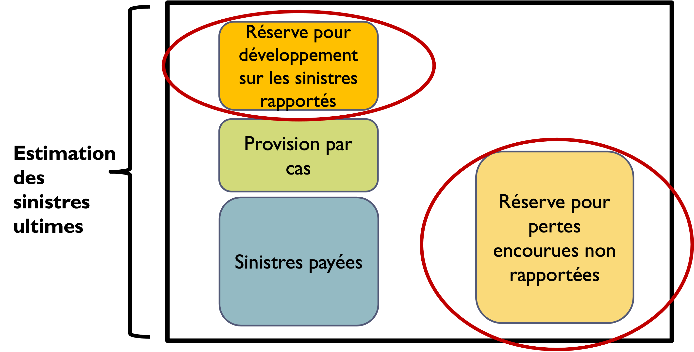

---
format:
  revealjs: default
chapter-css: diapos.css
metadata-files:
  - ../_diapos.yml
execute:
  echo: false
---

```{r}
#| label: setup
#| echo: false
#| include: false

library(tarifr)
project_dir <- Sys.getenv("QUARTO_PROJECT_DIR")
source(file.path(project_dir, "_extensions/alpa12/dynamic-year/dynamic-year.R"))
```

## Lectures recommandées

Ce chapitre est adapté du chapitre 6 du texte _Basic Ratemaking_ :

[Werner, G. et Modlin, C. (2016). _Basic Ratemaking_, Casualty Actuarial Society, 5e édition.](http://www.casact.org/library/studynotes/Werner_Modlin_Ratemaking.pdf)

## Contenu du chapitre {.progress-overview}

- Compilation des données de sinistres
- Ajustements aux sinistres
- Frais de règlement des sinistres

::: {.aside}
Adapté de : Werner, G. et Modlin, C. (2016), _Basic Ratemaking_, Casualty Actuarial Society.
:::

# Compilation des données de sinistres {data-progress-label="Compilation" subtitle="Sinistres payés et rapportés pour AC, AA, AP et AR"}

## Compilation des données de sinistres

Méthodes de compilation :

- Année de calendrier
- Année d’accident
- Année de police
- Année de sinistre rapporté

Les quatre méthodes s’appliquent pour compiler les données de sinistres.

## Année de calendrier

Les **sinistres payés** durant une année de calendrier comprennent tous les sinistres payés dans l’année de calendrier, sans égard à la date d’accident ou à la date rapportée.

Les **sinistres rapportés** pour l’année de calendrier sont les sinistres payés plus le changement dans les provisions par cas durant la période de 12 mois.

À la fin de l’année de calendrier, tous les sinistres rapportés sont fixes.

---

**Transactions** ayant lieu du 1er janvier au 31 décembre.

Tous les sinistres payés et le changement dans les provisions par cas durant la période de 12 mois affectent les sinistres rapportés de l’année de calendrier.

Même si :

- Ces transactions proviennent de polices émises avant l’année de calendrier en question.
- Les transactions de sinistres proviennent de sinistres avec date d’accident ou date rapportée avant l’année de calendrier en question.

## Année d’accident

La compilation des sinistres considère les sinistres qui ont eu lieu durant la période de 12 mois, sans égard au moment où la police a été écrite ou au moment où le sinistre est rapporté.

Les **sinistres payés** par année d’accident incluent les paiements seulement pour les sinistres qui ont lieu dans l’année.

Les **sinistres rapportés** sont les sinistres payés et les provisions par cas seulement pour les sinistres qui ont eu lieu dans l’année.

Au 31 décembre de l’année d’accident, les sinistres rapportés vont souvent changer lorsque d’autres réclamations sont rapportées, lorsque des réclamations sont payées ou lorsque les réserves changent.

---

**Accidents** ayant lieu du 1er janvier au 31 décembre.

Les sinistres payés et les provisions par cas des réclamations qui surviennent durant la période de 12 mois affectent les sinistres rapportés de l’année d’accident.

Même si :

- Les transactions proviennent de polices émises avant l’année d’accident en question.
- Les transactions ont lieu après l’année d’accident en question.

## Année de police

Les **sinistres payés** pour l’année de police incluent les paiements pour les réclamations couvertes par les polices écrites durant l’année.

Les **sinistres rapportés** pour l’année de police consistent en les paiements faits plus les provisions par cas seulement pour les réclamations couvertes par les polices écrites durant l’année.

Au 31 décembre de l’année de police, les sinistres vont souvent changer car d’autres réclamations surviennent, des réclamations sont payées ou les réserves changent.

---

**Polices émises** du 1er janvier au 31 décembre.

Les sinistres payés et les provisions par cas pour les polices ayant été émises dans l’année affectent les sinistres rapportés de l’année de police.

Cela demeure vrai même si les transactions de sinistres ont lieu après l’année de police en question.

## Année de sinistre rapporté

Similaire à l’année d’accident, sauf que les sinistres sont compilés selon la **date rapportée** plutôt que la date d’accident.

Méthode typiquement utilisée pour les produits des lignes commerciales avec des polices fondées sur les réclamations présentées _(ang. : claims-made policies)_.

---

Sinistres **rapportés** du 1er janvier au 31 décembre.

Les sinistres payés et les provisions par cas des réclamations qui sont rapportées durant la période de 12 mois affectent les sinistres rapportés de l’année de sinistre rapporté.

Même si :

- Ces transactions proviennent de polices émises avant l’année de sinistre rapporté en question.
- Ces transactions proviennent d’accidents ayant eu lieu avant l’année de sinistre rapporté.
- Les transactions de sinistres ont lieu après l’année de sinistre rapporté en question.

:::: {.question title="Compilation des sinistres"}

```{r}
#| label: sinistres-transactions-donnees
#| echo: false
#| include: false

transactions_sinistres <- data.frame(
  "Date d’effet de police" = c(
    dynamic_date("YYYY-07-01", -2), "", "", "",
    dynamic_date("YYYY-09-10", -2), "", ""
  ),
  "Date d’accident" = c(
    dynamic_date("YYYY-11-01", -2), "", "", "",
    dynamic_date("YYYY-02-14", -1), "", ""
  ),
  "Date rapportée" = c(
    dynamic_date("YYYY-11-19", -2), "", "", "",
    dynamic_date("YYYY-02-14", -1), "", ""
  ),
  "Date de transaction" = c(
    dynamic_date("YYYY-11-19", -2),
    dynamic_date("YYYY-02-01", -1),
    dynamic_date("YYYY-09-01", -1),
    dynamic_date("YYYY-01-15", 0),
    dynamic_date("YYYY-02-14", -1),
    dynamic_date("YYYY-11-01", -1),
    dynamic_date("YYYY-03-01", 0)
  ),
  "Paiement incrémental" = c("0\u00A0\\$", "1\u00A0000\u00A0\\$", "7\u00A0000\u00A0\\$", "3\u00A0000\u00A0\\$", "5\u00A0000\u00A0\\$", "8\u00A0000\u00A0\\$", "1\u00A0000\u00A0\\$"),
  "Provision par cas*" = c("10\u00A0000\u00A0\\$", "9\u00A0000\u00A0\\$", "2\u00A0500\u00A0\\$", "0\u00A0\\$", "10\u00A0000\u00A0\\$", "4\u00A0000\u00A0\\$", "0\u00A0\\$"),
  check.names = FALSE
)

afficher_transactions_sinistres <- function(colonne_date = NULL) {
  tableau <- transactions_sinistres

  if (!is.null(colonne_date)) {
    colonnes_utilisees <- c(colonne_date, 5:6)
    tableau[colonnes_utilisees] <- lapply(
      tableau[colonnes_utilisees],
      function(x) ifelse(nzchar(x), paste0("**", x, "**"), "")
    )
  }

  afficher_table(
    tableau,
    align = c("l", "l", "l", "l", "r", "r"),
    escape = FALSE
  )
}
```

##

Pour les deux réclamations suivantes :

```{r}
#| label: sinistres-transactions-table
#| echo: false
#| output: asis

afficher_transactions_sinistres()
```

::: aside
*\* Provision par cas évaluée à la date de transaction.*
:::

##

En supposant que les données sont vues au , calculer :

- Les sinistres rapportés pour chacune des années  à , compilés par :
  - Année de calendrier
  - Année d’accident
  - Année de police
  - Année de sinistre rapporté


::: {.solution}

## {.text-xs}

```{r}
#| label: sinistres-calendrier-table
#| echo: false
#| output: asis

afficher_transactions_sinistres(4)
```

$$
\text{Sinistres rapportés pour une année de calendrier} = \\
\text{Paiements faits dans l’année}
+ \text{Changement de provision par cas dans l’année}
$$

- $`r dynamic_year(-2)`: (0) + (10\,000) = 10\,000$
- $`r dynamic_year(-1)`: (1\,000 + 7\,000 + 5\,000 + 8\,000) + ((2\,500 + 4\,000) - (10\,000 + 0)) = 17\,500$
- $`r dynamic_year(0)`: (3\,000 + 1\,000) + ((0) - (2\,500 + 4\,000)) = -2\,500$

## {.text-xs}

```{r}
#| label: sinistres-accident-table
#| echo: false
#| output: asis

afficher_transactions_sinistres(2)
```

$$
\text{Sinistres rapportés pour une année d’accident} = \\
\text{Sinistres payés pour les accidents survenus dans l’année} + \\
\text{Provisions par cas pour les accidents survenus dans l’année}
$$

- $`r dynamic_year(-2)`: (1\,000 + 7\,000 + 3\,000) + (0) = 11\,000$
- $`r dynamic_year(-1)`: (5\,000 + 8\,000 + 1\,000) + (0) = 14\,000$
- $`r dynamic_year(0)`: 0$

## {.text-xs}

```{r}
#| label: sinistres-police-table
#| echo: false
#| output: asis

afficher_transactions_sinistres(1)
```

$$
\text{Sinistres rapportés pour une année de police} = \\
\text{Sinistres payés pour les polices effectives dans l’année} + \\
\text{Provisions par cas pour les polices effectives dans l’année}
$$

- $`r dynamic_year(-2)`: (1\,000 + 7\,000 + 3\,000 + 5\,000 + 8\,000 + 1\,000) + (0) = 25\,000$
- $`r dynamic_year(-1)`: 0$
- $`r dynamic_year(0)`: 0$

## {.text-xs}

```{r}
#| label: sinistres-rapport-table
#| echo: false
#| output: asis

afficher_transactions_sinistres(3)
```

$$
\text{Sinistres rapportés pour une année de sinistre rapporté} = \\
\text{Sinistres payés pour les réclamations rapportées dans l’année} + \\
\text{Provisions par cas pour les réclamations rapportées dans l’année}
$$

- $`r dynamic_year(-2)`: (1\,000 + 7\,000 + 3\,000) + (0) = 11\,000$
- $`r dynamic_year(-1)`: (5\,000 + 8\,000 + 1\,000) + (0) = 14\,000$
- $`r dynamic_year(0)`: 0$

:::

::::

## {.remember-slide}

Compilation des sinistres :

:::: {.columns}
::: {.column}
- AC : Date de transaction
- AP : Date d'écriture de la police
:::
::: {.column}
- AA : Date de l'accident
- AR : Date rapportée du sinistre
:::
::::

# Ajustements aux sinistres {data-progress-label="Ajustements" subtitle="Projeter l'expérience historique au niveau de coût ultime et prospectif"}

## Ajustements aux sinistres

Les sinistres doivent être projetés au niveau de coût espéré prospectif.

Pour les calculer, on utilise normalement les sinistres historiques avec quelques ajustements :

- Sinistres extraordinaires
- Changements à la couverture
- Développement des sinistres
- Tendance dans les sinistres

## Sinistres extraordinaires

Exemples de sinistres extraordinaires :

:::: {.columns}
::: {.column}
### Pertes majeures

- Incendie causant une perte totale de 400 000 $
- Poursuite d’un propriétaire de logement pour 1 M$ en responsabilité
- Vol d’un bateau d’une valeur de 75 000 $
:::

::: {.column}
### Catastrophes

- Réparation de carrosserie pour des centaines de véhicules suite à un évènement de grêle
- Inondations et refoulements d’égouts suite à un débordement de rivière
:::
::::

---

### Pertes majeures {.english-subtitle subtitle="Large individual losses or shock losses"}

Si elles sont incluses telles quelles, les taux indiqués peuvent augmenter immédiatement après une année où il y a eu des pertes majeures ou diminuer après une année sans pertes majeures.

Conséquemment, les données historiques utilisées pour projeter les sinistres futurs excluent souvent la portion du sinistre au-dessus d’un seuil prédéterminé.

---

#### Étape 1 : Sélection du seuil d’écrêtement des sinistres

Le seuil pour les pertes majeures doit permettre un équilibre entre :

- Inclure le plus de sinistres possibles
- Minimiser la volatilité dans l’analyse de tarification

Exemples de méthodes de sélection du seuil d’écrêtement :

- 99e percentile de la distribution par montant de perte
- 99e percentile de la distribution par pourcentage du montant d’assurance

---

#### Étape 2 : Inclusion d’une provision pour les pertes majeures

Afin d’équilibrer l’équation fondamentale en assurance, on doit tout de même inclure une provision pour la portion des pertes majeures qui est au-dessus du seuil.

On regardera donc ces sinistres sur une plus grande période. On suppose que, bien que très volatile à court terme, la proportion des sinistres attribuable aux pertes majeures sera assez stable à long terme.

```{r}
#| label: pertes-majeures-tableau
#| echo: false
#| include: false

seuil_ecretement <- 1e6

tableau_sinistres_excedentaires <- data.frame(
  "Année d’accident" = 1996:2010,
  "Sinistres rapportés" = c(
    118369707, 117938146, 119887865, 118488983, 122329298,
    120157205, 123633881, 124854827, 125492840, 127430355,
    123245269, 123466498, 129241078, 123302570, 123408837
  ),
  "Nb réclam. > 1 M" = c(5, 1, 3, 0, 7, 3, 0, 1, 0, 6, 3, 0, 10, 0, 3),
  "Sinistres non écrêtés pour les réclamations > 1 M" = c(
    6232939, 1300000, 3923023, 0, 12938382,
    3824311, 0, 3000000, 0, 13466986,
    4642423, 0, 17038332, 0, 4351805
  ),
  check.names = FALSE
)

tableau_sinistres_excedentaires[[5]] <-
  tableau_sinistres_excedentaires[[4]] - tableau_sinistres_excedentaires[[3]] * seuil_ecretement
tableau_sinistres_excedentaires[[6]] <-
  tableau_sinistres_excedentaires[[2]] - tableau_sinistres_excedentaires[[5]]
tableau_sinistres_excedentaires[[7]] <-
  tableau_sinistres_excedentaires[[5]] / tableau_sinistres_excedentaires[[6]]
names(tableau_sinistres_excedentaires)[5:7] <- c(
  "Portions des sinistres > 1 M",
  "Portions des sinistres <= 1 M",
  "Ratio excédentaire à 1 M"
)

total_sinistres_excedentaires <- tableau_sinistres_excedentaires[1, ]
total_sinistres_excedentaires[[1]] <- "Total"
total_sinistres_excedentaires[2:6] <- lapply(tableau_sinistres_excedentaires[2:6], sum)
total_sinistres_excedentaires[[7]] <-
  total_sinistres_excedentaires[[5]] / total_sinistres_excedentaires[[6]]
tableau_sinistres_excedentaires <- rbind(
  tableau_sinistres_excedentaires,
  total_sinistres_excedentaires
)

afficher_tableau_sinistres_excedentaires <- function(
  colonnes = seq_len(ncol(tableau_sinistres_excedentaires))
) {
  tableau <- tableau_sinistres_excedentaires[, colonnes, drop = FALSE]
  indices_dollars <- intersect(c(2, 4:6), colonnes)
  indices_dollars <- match(indices_dollars, colonnes)
  indice_pourcentage <- match(7, colonnes)

  formats <- list()
  if (length(indices_dollars)) {
    formats[[length(formats) + 1]] <- list(
      colonnes = indices_dollars,
      type = "montant",
      symbole = TRUE
    )
  }
  if (!is.na(indice_pourcentage)) {
    formats[[length(formats) + 1]] <- list(
      colonnes = indice_pourcentage,
      type = "pourcentage",
      digits = 1
    )
  }

  entetes_affiches <- c(
    "Année d’accident",
    "Sinistres rapportés",
    "Nb réclam. > 1 M",
    "Sinistres non écrêtés pour les réclamations > 1 M",
    "Portions des sinistres > 1 M",
    "Portions des sinistres <= 1 M",
    "Ratio excédentaire à 1 M"
  )
  entetes_calculs <- c(
    "(1)",
    "(2)",
    "(3)",
    "(4)",
    "(5) = (4) - (3) × 1 M",
    "(6) = (2) - (5)",
    "(7) = (5) / (6)"
  )
  names(tableau) <- entetes_affiches[colonnes]

  afficher_table(
    tableau,
    align = c("r", rep("r", ncol(tableau) - 1)),
    formats = formats,
    lignes_gras = "derniere",
    escape = FALSE,
    entetes_calculs = if (any(colonnes >= 5)) entetes_calculs[colonnes] else NULL
  )
}
```

:::: {.question title="Facteur pour sinistres excédentaires"}

##

:::: {.columns}
::: {.column}

Avec les données suivantes, calculer le facteur pour sinistres excédentaires à 1 M (_excess loss factor à 1 M_).

::: {.text-xs}
*Note : Dans cet exemple-ci, le seuil d’écrêtement est donné.
Normalement, il faut d’abord choisir le seuil, et ensuite calculer le facteur pour sinistres excédentaires.*
:::

:::
::: {.column .text-xs}

```{r}
#| label: pertes-majeures-donnees
#| echo: false
#| output: asis

afficher_tableau_sinistres_excedentaires(1:4)
```

:::
::::

::: {.solution}

## {.text-xs}

```{r}
#| label: pertes-majeures-calculs
#| echo: false
#| output: asis

afficher_tableau_sinistres_excedentaires(1:4)
```

## {.text-xs}

```{r}
#| label: pertes-majeures-calculs-complement
#| echo: false
#| output: asis

afficher_tableau_sinistres_excedentaires(c(1, 5:7))
```

##

Comme les sinistres excédentaires à 1 M représentent 1,6 % des sinistres écrêtés à 1 M, le facteur pour sinistres excédentaires sélectionné est :

$$
1 + \frac{28\,718\,201}{1\,812\,529\,158} = 1.016
$$

::: {.notes}
Le seuil d’écrêtement est donné ici. Normalement, il faut d’abord choisir le seuil, et ensuite calculer le facteur pour sinistres excédentaires.
:::

:::

::::

## Sinistres catastrophiques {.english-subtitle subtitle="Catastrophe losses"}


Les données historiques utilisées pour projeter les sinistres futurs excluent normalement les catastrophes.

Au lieu d’utiliser les sinistres catastrophiques historiques tels quels, on remplacera par un montant de sinistre espéré moyen.

---

### Catastrophes non modélisées

Événements qui surviennent plutôt régulièrement sur plusieurs années.

Comme pour les sinistres individuels très élevés, on calcule sur une longue période le ratio des sinistres attribuables à ces catastrophes par rapport aux sinistres non catastrophiques.

Exemple : grêle

---

### Catastrophes modélisées

Événements qui sont extrêmement sporadiques et génèrent des réclamations de grande sévérité.

Des modèles de catastrophes existent pour prédire les dommages qui en résultent.

Exemples : tremblement de terre, inondation

## Changements à la couverture ou aux bénéfices {.english-subtitle subtitle="Changes in coverage or benefit levels"}


Les sinistres projetés doivent refléter les changements à la couverture et aux bénéfices.

Deux effets :

- Directs, sur les montants à payer en sinistres
- Indirects, par exemple un changement dans la propension à réclamer

:::: {.question title="Effet d’un changement de limite"}

```{r}
#| label: changement-limite-donnees
#| echo: false
#| include: false

sinistres_limites <- data.frame(
  "No. réclamation" = 1:6,
  "Sinistres écrêtés à 5 000 $" = c(1100, 2350, 3700, 4100, 5000, 5000),
  check.names = FALSE
)

afficher_sinistres_limites <- function(inclure_effet = FALSE) {
  tableau <- sinistres_limites

  if (inclure_effet) {
    tableau[[3]] <- pmin(tableau[[2]], 3000)
    names(tableau)[3] <- "Sinistres écrêtés à 3 000 $"
    tableau[[4]] <- tableau[[3]] / tableau[[2]] - 1
    names(tableau)[4] <- "Effet du changement"

    total <- tableau[1, , drop = FALSE]
    total[[1]] <- "Total"
    total[2:3] <- lapply(tableau[2:3], sum)
    total[[4]] <- total[[3]] / total[[2]] - 1
    tableau <- rbind(tableau, total)
  }

  afficher_table(
    tableau,
    align = rep("r", ncol(tableau)),
    formats = list(
      list(colonnes = 2, type = "montant", symbole = TRUE),
      list(colonnes = 3, type = "montant", symbole = TRUE),
      list(colonnes = 4, type = "pourcentage", digits = 1)
    )[seq_len(1 + 2*inclure_effet)],
    lignes_gras = if (inclure_effet) "derniere" else integer(),
    escape = FALSE,
    entetes_calculs = if (inclure_effet) c(
      "(1)",
      "(2)",
      "(3) = min((2), 3 000 $)",
      "(4) = (3) / (2) - 1"
    ) else NULL
  )
}
```

##

À l’aide des sinistres suivants, calculer l’effet d’un changement de limite qui passe de 5 000 $ à 3 000 $.

```{r}
#| label: changement-limite-table
#| echo: false
#| output: asis

afficher_sinistres_limites()
```

::: {.solution}

##

```{r}
#| label: changement-limite-calculs
#| echo: false
#| output: asis

afficher_sinistres_limites(inclure_effet = TRUE)
```

L’effet du changement est donc de -27,3 % sur le montant des réclamations.

::: aside
*Normalement, on utilise un plus grand nombre de réclamations pour calculer cet impact.*
:::

:::

::::

:::: {.question title="Assurance invalidité"}

```{r}
#| label: assurance-invalidite-donnees
#| echo: false
#| include: false

assurance_invalidite <- data.frame(
  "Salaire hebdomadaire" = c(
    "Moins de 500\u00A0\\$", "500\u00A0\\$ à 749\u00A0\\$", "750\u00A0\\$ à 999\u00A0\\$",
    "1\u00A0000\u00A0\\$ à 1\u00A0249\u00A0\\$", "1\u00A0250\u00A0\\$ à 1\u00A0499\u00A0\\$", "1\u00A0500\u00A0\\$ +"
  ),
  "Nb de travailleurs" = c(7, 24, 27, 19, 12, 11),
  "Salaires totaux" = c(3000, 16252, 23950, 23048, 16500, 17250),
  "Bénéfices actuels payables" = c(3500, 12000, 15975, 15373, 11006, 11000),
  "Bénéfices proposés payables" = c(3500, 12000, 15975, 15373, 9996, 9163),
  "Calcul des bénéfices actuels" = c(
    "7 × 500\u00A0\\$ = 3\u00A0500\u00A0\\$", "24 × 500\u00A0\\$ = 12\u00A0000\u00A0\\$",
    "0,667 × 23\u00A0950\u00A0\\$ = 15\u00A0975\u00A0\\$", "0,667 × 23\u00A0048\u00A0\\$ = 15\u00A0373\u00A0\\$",
    "0,667 × 16\u00A0500\u00A0\\$ = 11\u00A0006\u00A0\\$", "11 × 1\u00A0000\u00A0\\$ = 11\u00A0000\u00A0\\$"
  ),
  "Calcul des bénéfices proposés" = c(
    "3\u00A0500\u00A0\\$", "12\u00A0000\u00A0\\$", "15\u00A0975\u00A0\\$",
    "15\u00A0373\u00A0\\$", "12 × 833\u00A0\\$ = 9\u00A0996\u00A0\\$", "11 × 833\u00A0\\$ = 9\u00A0163\u00A0\\$"
  ),
  check.names = FALSE
)

afficher_assurance_invalidite <- function(calculs = FALSE) {
  if (!calculs) {
    tableau <- assurance_invalidite[1:3]
    total <- tableau[1, , drop = FALSE]
    total[[1]] <- "Total"
    total[2:3] <- lapply(assurance_invalidite[2:3], sum)
  } else {
    tableau <- assurance_invalidite[c(1, 6, 7)]
    names(tableau) <- c(
      "Salaire hebdomadaire",
      "Bénéfices actuels payables",
      "Bénéfices proposés payables"
    )
    total <- tableau[1, , drop = FALSE]
    total[[1]] <- "Total"
    total[[2]] <- format_montant(sum(assurance_invalidite[[4]]), symbole = TRUE)
    total[[3]] <- format_montant(sum(assurance_invalidite[[5]]), symbole = TRUE)
  }

  tableau <- rbind(tableau, total)
  afficher_table(
    tableau,
    align = c("l", "r", "r"),
    formats = if (calculs) list() else list(
      list(colonnes = 3, type = "montant", symbole = TRUE)
    ),
    lignes_gras = "derniere",
    escape = FALSE
  )
}
```

## {.text-small}

:::: {.columns}
::: {.column}
En assurance invalidité :

- Le taux de compensation est 66,7 % du salaire.
- Le salaire hebdomadaire moyen est 1 000 $.
- L’indemnité minimale est 50 % du salaire hebdomadaire moyen.
- L’indemnité maximale passe de 100 % à 83,3 % du salaire hebdomadaire moyen.
:::
::: {.column}
```{r}
#| label: assurance-invalidite-table
#| echo: false
#| output: asis

afficher_assurance_invalidite()
```
:::
::::

Calculer l’effet direct du changement de l’indemnité maximale et discuter d’un effet indirect possible à la suite de ce changement.

::: {.solution}

##

L’indemnité minimale de 500 $ est applicable à tous ceux qui gagnent moins de :

$$
500 \$ / 0.667 = 749.63 \$
$$

L’indemnité maximale **avant changement** de 1 000 $ est applicable à tous ceux qui gagnent plus de :

$$
1\,000 \$ / 0.667 = 1\,499.25 \$
$$

L’indemnité maximale **après changement** de 833 $ est applicable à tous ceux qui gagnent plus de :

$$
833 \$ / 0.667 = 1\,248.88 \$
$$

## {.text-smaller}

```{r}
#| label: assurance-invalidite-calculs
#| echo: false
#| output: asis

afficher_assurance_invalidite(calculs = TRUE)
```

L’**effet direct** sur les bénéfices de ce changement dans l’assurance invalidité est :

$$
66\,007 / 68\,854 - 1 = -0.041
$$

##

Un **effet indirect** possible de cette mesure est une moins grande fréquence de réclamation chez les assurés ayant un revenu de 1 250 $ et plus, comme les bénéfices proposés pour ces assurés sont inférieurs aux bénéfices actuels.

:::

::::

:::: {.question title="Changement de loi"}

##

Un changement de loi hausse de 5 % les sinistres sur les polices **écrites après** le .

Calculer le facteur d’ajustement à appliquer aux sinistres du 3e trimestre de  pour tenir compte du changement de loi.

```{r}
#| label: law-change-diagram-data
#| echo: false
#| include: false

changement_loi <- data.frame(
  date = dynamic_date("YYYY-08-15", -1),
  label = "+5 %",
  type = "diagonal"
)

sections_changement_loi <- data.frame(
  date = c(
    dynamic_date("YYYY-08-15", -1),
    dynamic_date("YYYY-09-20", -1)
  ),
  y = c(55, 4.5),
  label = c("1", "2")
)

fin_troisieme_trimestre <- data.frame(
  date = dynamic_date("YYYY-10-01", -1),
  label = ""
)
```

```{r}
#| label: law-change-diagram
#| fig-alt: "Sinistres répartis sur une ligne du temps avant et après un changement législatif."
#| echo: false
#| fig-width: 9
#| fig-height: 3.6

tarifr::rate_level_diagram(
  start_date = dynamic_date("YYYY-01-01", -1),
  end_date = dynamic_date("YYYY-01-01", 1),
  analyzed_start = dynamic_date("YYYY-07-01", -1),
  analyzed_end = dynamic_date("YYYY-10-01", -1),
  experience_period = "calendar",
  policy_term_months = 12,
  period_months = 3,
  changes = changement_loi,
  minor_grid_months = 3
)
```

::: {.solution}

## {.text-smaller}

```{r}
#| label: law-change-diagram-sections
#| fig-alt: "Périodes de sinistres séparées par la date d'un changement législatif."
#| echo: false
#| fig-width: 9
#| fig-height: 2.5

tarifr::rate_level_diagram(
  start_date = dynamic_date("YYYY-01-01", -1),
  end_date = dynamic_date("YYYY-01-01", 1),
  analyzed_start = dynamic_date("YYYY-07-01", -1),
  analyzed_end = dynamic_date("YYYY-10-01", -1),
  experience_period = "calendar",
  policy_term_months = 12,
  period_months = 3,
  changes = changement_loi,
  zone_labels = sections_changement_loi,
  reference_lines = fin_troisieme_trimestre,
  mar = c(2.5, 5.4, 2.5, 2.4)
)
```


- Aire de la section 2 : $0.5 \times (1.5 / 12) / 2 = 0.03125$
- Aire de la section 1 : $1 - 0.03125 = 0.96875$
- Facteur d’ajustement pour les sinistres du 3e trimestre : $\frac{1.05}{0.96875 \times 1 + 0.03125 \times 1.05} = 1.0484$

:::

::::

## Développement des sinistres {.english-subtitle subtitle="Loss development"}


Processus d’ajuster les sinistres rapportés au niveau ultime espéré.

{width=92% fig-alt="Découpage des sinistres montrant les sinistres payés, la provision par cas, la réserve pour développement sur les sinistres rapportés et la réserve pour pertes encourues non rapportées."}

:::: {.question title="Chain Ladder"}

## {.text-smaller}

La méthode _Chain Ladder_, qui présente des triangles de développement des sinistres, est une méthode couramment utilisée pour développer les sinistres.

```{r}
#| label: chain-ladder-donnees
#| echo: false
#| include: false

annees_accident <- dynamic_year(-7):dynamic_year(-2)

triangle_sinistres <- data.frame(
  "Année d’accident" = annees_accident,
  "15" = c(1000, 1030, 1061, 1093, 1126, 1159),
  "27" = c(1500, 1584, 1560, 1651, 1662, NA),
  "39" = c(1925, 2020, 2070, 2125, NA, NA),
  "51" = c(2145, 2209, 2276, NA, NA, NA),
  "63" = c(2190, 2240, NA, NA, NA, NA),
  "75" = c(2188, NA, NA, NA, NA, NA),
  check.names = FALSE
)

sinistres_par_age <- as.matrix(triangle_sinistres[-1])
ages_developpement <- as.integer(names(triangle_sinistres)[-1])
facteurs_developpement <- sinistres_par_age[, -1, drop = FALSE] /
  sinistres_par_age[, -ncol(sinistres_par_age), drop = FALSE]

tableau_developpement <- data.frame(
  "Année d’accident" = triangle_sinistres[[1]],
  facteurs_developpement,
  check.names = FALSE
)
names(tableau_developpement)[-1] <- paste0(
  ages_developpement[-length(ages_developpement)], "-",
  ages_developpement[-1]
)

facteurs_selectionnes <- round(
  colMeans(facteurs_developpement, na.rm = TRUE),
  2
)
moyenne_developpement <- tableau_developpement[1, , drop = FALSE]
moyenne_developpement[[1]] <- "Moyenne arithmétique"
moyenne_developpement[-1] <- as.list(facteurs_selectionnes)
tableau_developpement <- rbind(tableau_developpement, moyenne_developpement)

facteurs_ultimes <- c(1, cumprod(rev(facteurs_selectionnes)))
tableau_ultimes <- data.frame(
  "Année d’accident" = triangle_sinistres[[1]],
  "Âge (mois) au 31 mars" = rev(ages_developpement),
  "Sinistres rapportés au 31 mars" = diag(sinistres_par_age[, ncol(sinistres_par_age):1]),
  "Facteur ultime" = facteurs_ultimes,
  check.names = FALSE
)
names(tableau_ultimes)[2:3] <- paste(
  names(tableau_ultimes)[2:3],
  dynamic_year(-1)
)
tableau_ultimes[[5]] <- round(tableau_ultimes[[3]] * tableau_ultimes[[4]])
names(tableau_ultimes)[5] <- "Sinistres ultimes estimés"

total_ultimes <- tableau_ultimes[1, , drop = FALSE]
total_ultimes[[1]] <- "Total"
total_ultimes[[2]] <- NA
total_ultimes[[3]] <- sum(tableau_ultimes[[3]])
total_ultimes[[4]] <- NA
total_ultimes[[5]] <- sum(tableau_ultimes[[5]])
tableau_ultimes <- rbind(tableau_ultimes, total_ultimes)
```

Sinistres rapportés (en milliers de dollars), par âge (en mois) d’année d’accident, vus au .

```{r}
#| label: chain-ladder-triangle-table
#| echo: false
#| output: asis

afficher_table(
  triangle_sinistres,
  align = c("r", rep("r", 6)),
  formats = list(list(colonnes = 2:7, type = "nombre", digits = 0))
)
```

Calculer les facteurs de développement des sinistres, puis développer les sinistres rapportés à l’ultime.

::: {.solution}

##

### Facteurs de développement des sinistres

```{r}
#| label: chain-ladder-facteurs-table
#| echo: false
#| output: asis

afficher_table(
  tableau_developpement,
  align = c("l", rep("r", 5)),
  formats = list(list(colonnes = 2:6, type = "nombre", digits = 2)),
  lignes_gras = "derniere"
)
```

Exemples de calcul :
$$
1.50 = 1500 / 1000
\qquad
1.28 = 1925 / 1500
$$

##

### Sinistres rapportés développés à l'ultime

```{r}
#| label: chain-ladder-ultimes-table
#| echo: false
#| output: asis

afficher_table(
  tableau_ultimes,
  align = c("l", rep("r", 4)),
  formats = list(
    list(colonnes = c(2, 3, 5), type = "nombre", digits = 0),
    list(colonnes = 4, type = "nombre", digits = 2)
  ),
  lignes_gras = "derniere",
  entetes_calculs = c(
    "(1)",
    "(2)",
    "(3)",
    "(4)",
    "(5) = (3) × (4)"
  )
)
```

$$
2.17 = 1.50 \times 1.29 \times 1.10 \times 1.02 \times 1
$$

:::

::::

## Tendance dans les sinistres {.english-subtitle subtitle="Loss trend"}

La fréquence de sinistre et le coût des sinistres peuvent changer dans le temps.

On détermine d’abord le facteur de tendance dans les sinistres, ensuite la période de projection pour ainsi obtenir le facteur de projection des sinistres.

---

On regarde habituellement la fréquence et la sévérité séparément pour établir la tendance dans les sinistres.

Deux méthodes communes pour mesurer la tendance dans les données :

- Régression linéaire
  - On calcule le changement additif d’une période à l’autre.
- Régression exponentielle
  - On calcule le changement en pourcentage d’une période à l’autre.

:::: {.question title="Tendance dans les sinistres"}

## {.text-scale scale=0.62}

```{r}
#| label: tendance-sinistres-donnees
#| echo: false
#| include: false

dates_trimestrielles <- seq.Date(
  dynamic_date("YYYY-03-31", -6),
  dynamic_date("YYYY-12-31", -2),
  by = "quarter"
)

donnees_tendance_sinistres <- data.frame(
  "Fin de trimestre" = format(dates_trimestrielles, "%b-%y"),
  "Exposition acquise" = c(131911, 132700, 133602, 135079, 137384, 138983, 140396, 140997, 140378, 139682, 138982, 138984, 139155, 139618, 139996, 140141, 140754, 141534, 141800, 142986),
  "Nombre de réclamations fermées" = c(7745, 7785, 7917, 7928, 7997, 8037, 7939, 7831, 7748, 7719, 7730, 7790, 7782, 7741, 7720, 7691, 7735, 7769, 7755, 7778),
  "Sinistres payés" = c(8220899, 8381016, 8594389, 8705108, 8816379, 8901163, 8873491, 8799730, 8736859, 8676220, 8629925, 8642835, 8602105, 8535327, 8466272, 8412159, 8513679, 8614224, 8702135, 8761588),
  "Fréquence" = c(0.0587, 0.0587, 0.0593, 0.0587, 0.0582, 0.0578, 0.0565, 0.0555, 0.0552, 0.0553, 0.0556, 0.0560, 0.0559, 0.0554, 0.0551, 0.0549, 0.0550, 0.0549, 0.0547, 0.0544),
  "Changement annuel de fréquence" = c(NA, NA, NA, NA, -0.009, -0.015, -0.047, -0.055, -0.052, -0.043, -0.016, 0.009, 0.013, 0.002, -0.009, -0.020, -0.016, -0.009, -0.007, -0.009),
  "Sévérité" = c(1061.45, 1076.56, 1085.56, 1098.02, 1102.46, 1107.52, 1117.71, 1123.70, 1127.63, 1124.01, 1116.42, 1109.48, 1105.38, 1102.61, 1096.67, 1093.77, 1100.67, 1108.79, 1122.13, 1126.46),
  "Changement annuel de sévérité" = c(NA, NA, NA, NA, 0.039, 0.029, 0.030, 0.023, 0.023, 0.015, -0.001, -0.013, -0.020, -0.019, -0.018, -0.014, -0.004, 0.006, 0.023, 0.030),
  "Prime pure" = c(62.32, 63.16, 64.33, 64.44, 64.17, 64.04, 63.20, 62.41, 62.24, 62.11, 62.09, 62.19, 61.82, 61.13, 60.48, 60.03, 60.49, 60.86, 61.37, 61.28),
  "Changement annuel de prime pure" = c(NA, NA, NA, NA, 0.030, 0.014, -0.018, -0.032, -0.030, -0.030, -0.018, -0.004, -0.007, -0.016, -0.026, -0.035, -0.022, -0.004, 0.015, 0.021),
  check.names = FALSE
)
```

::: {.tendance-sinistres-table}

```{r}
#| label: tendance-sinistres-table
#| echo: false
#| output: asis

afficher_table(
  donnees_tendance_sinistres,
  align = c("l", rep("r", 9)),
  formats = list(
    list(colonnes = 2:3, type = "nombre", digits = 0),
    list(colonnes = 4, type = "montant", digits = 0, symbole = TRUE),
    list(colonnes = 5, type = "nombre", digits = 4),
    list(colonnes = c(6, 8, 10), type = "pourcentage", digits = 1),
    list(colonnes = c(7, 9), type = "montant", digits = 2, symbole = TRUE)
  )
)
```

:::

::: {.solution}

```{r}
#| label: tendance-sinistres-regressions-donnees
#| echo: false
#| include: false

donnees_tendance_regressions <- data.frame(
  "Nombre de points" = paste(c(20, 16, 12, 8, 6, 4), "points"),
  "Fréquence, régression exponentielle" = c(
    "-1,7\u00A0%", "-1,3\u00A0%", "-0,7\u00A0%", "-1,2\u00A0%", "-0,9\u00A0%", "-1,5\u00A0%"
  ),
  "Sévérité, régression exponentielle" = c(
    "0,5\u00A0%", "-0,1\u00A0%", "-0,2\u00A0%", "1,2\u00A0%", "2,5\u00A0%", "3,3\u00A0%"
  ),
  "Prime pure, régression exponentielle" = c(
    "-1,2\u00A0%", "-1,4\u00A0%", "-0,9\u00A0%", "-0,1\u00A0%", "1,6\u00A0%", "1,9\u00A0%"
  ),
  check.names = FALSE
)
```

```{r}
#| label: tendance-sinistres-regressions-table
#| echo: false
#| output: asis

afficher_table(
  donnees_tendance_regressions,
  align = c("l", "r", "r", "r"),
  entetes_calculs = c(
    "(1)",
    "(2)",
    "(3)",
    "(4) = (2) + (3)"
  )
)
```

Sélection pour la fréquence : -1 %.

Sélection pour la sévérité : +2 %.

Sélection pour la prime pure : $(1 - 0.01)(1 + 0.02) \approx +1\%$

:::

::::

## Période de projection {.english-subtitle subtitle="Trend period"}


De la date moyenne d’accident dans la période d’expérience jusqu’à la date moyenne d’accident pour la période durant laquelle les taux vont être effectifs.

Dépend du terme de la police et de la période durant laquelle les taux seront en vigueur.

:::: {.question title="Période de projection des sinistres"}

##

Déterminer les dates de début et de fin de la période de projection des sinistres, pour :

- Année d'accident , police de 1 an
- Année d'accident , police de 6 mois
- Année de police , police de 1 an

Date effective du changement de taux : .

Les taux seront en vigueur pendant 1 an.

::: {.solution}

##

### Année d’accident , polices annuelles

```{r}
#| label: trend-period-loss-accident-annual
#| fig-alt: "Période de tendance des sinistres entre une année d'accident historique et une période de projection annuelle."
#| echo: false
#| fig-height: 2.5

tarifr::trend_period_diagram(
  experience_start = dynamic_date("YYYY-01-01", -4),
  experience_end = dynamic_date("YYYY-01-01", -3),
  prospective_start = dynamic_date("YYYY-01-01", 0),
  prospective_end = dynamic_date("YYYY-01-01", 1),
  experience_period_type = "accident",
  trend_type = "loss",
  policy_term_months = 12,
  experience_label = paste("AA", dynamic_year(-4)),
  prospective_label = paste("AP", dynamic_year(0)),
  experience_average_date = dynamic_date("YYYY-07-01", -4),
  prospective_average_date = dynamic_date("YYYY-01-01", 1),
  xlim_start = dynamic_date("YYYY-01-01", -5),
  xlim_end = dynamic_date("YYYY-07-01", 2),
  axis_dates = seq.Date(
    dynamic_date("YYYY-01-01", -5),
    dynamic_date("YYYY-01-01", 2),
    by = "year"
  ),
  y_axis_label = "% du terme de police expiré"
)
```

- Date moyenne d’accident de l’année d’accident  : 
- Date moyenne d’accident de l’année de police  : , soit 6 mois après le , date moyenne souscrite de l’année de police 
- Durée de la période de projection : 4,5 ans

##

### Année d’accident , polices semi-annuelles

```{r}
#| label: trend-period-loss-accident-semiannual
#| fig-alt: "Période de tendance des sinistres entre une année d'accident historique et une période de projection semestrielle."
#| echo: false
#| fig-height: 2.5

tarifr::trend_period_diagram(
  experience_start = dynamic_date("YYYY-01-01", -4),
  experience_end = dynamic_date("YYYY-01-01", -3),
  prospective_start = dynamic_date("YYYY-01-01", 0),
  prospective_end = dynamic_date("YYYY-01-01", 1),
  experience_period_type = "accident",
  trend_type = "loss",
  policy_term_months = 6,
  experience_label = paste("AA", dynamic_year(-4)),
  prospective_label = paste("AP", dynamic_year(0)),
  experience_average_date = dynamic_date("YYYY-07-01", -4),
  prospective_average_date = dynamic_date("YYYY-10-01", 0),
  xlim_start = dynamic_date("YYYY-01-01", -5),
  xlim_end = dynamic_date("YYYY-07-01", 2),
  axis_dates = seq.Date(
    dynamic_date("YYYY-01-01", -5),
    dynamic_date("YYYY-01-01", 2),
    by = "year"
  ),
  y_axis_label = "% du terme de police expiré"
)
```

- Date moyenne d’accident de l’année d’accident  : 
- Date moyenne d’accident de l’année de police  : , soit 3 mois après le , date moyenne souscrite de l’année de police 
- Durée de la période de projection : 4,25 ans

##

### Année de police , polices annuelles


```{r}
#| label: trend-period-loss-policy-annual
#| fig-alt: "Période de tendance des sinistres entre une année de police historique et une période de projection annuelle."
#| echo: false
#| fig-height: 2.5

tarifr::trend_period_diagram(
  experience_start = dynamic_date("YYYY-01-01", -4),
  experience_end = dynamic_date("YYYY-01-01", -3),
  prospective_start = dynamic_date("YYYY-01-01", 0),
  prospective_end = dynamic_date("YYYY-01-01", 1),
  experience_period_type = "policy",
  trend_type = "loss",
  policy_term_months = 12,
  experience_label = paste("AP", dynamic_year(-4)),
  prospective_label = paste("AP", dynamic_year(0)),
  experience_average_date = dynamic_date("YYYY-01-01", -3),
  prospective_average_date = dynamic_date("YYYY-12-31", 0),
  xlim_start = dynamic_date("YYYY-01-01", -5),
  xlim_end = dynamic_date("YYYY-07-01", 2),
  axis_dates = seq.Date(
    dynamic_date("YYYY-01-01", -5),
    dynamic_date("YYYY-01-01", 2),
    by = "year"
  ),
  y_axis_label = "% du terme de police expiré"
)
```


- Date moyenne d’accident de l’année de police  : , soit 6 mois après le , date moyenne souscrite de l’année de police 
- Date moyenne d’accident de l’année de police  : , soit 6 mois après le , date moyenne souscrite de l’année de police 
- Durée de la période de projection : 4 ans

:::

::::

## {.remember-slide}

Pour projeter les sinistres historiques au niveau prospectif :

- Les développer au niveau ultime espéré.
- Sélectionner une tendance à partir de la fréquence et de la sévérité.
- Appliquer cette tendance pendant la période de projection.

```{r}
#| label: severite-limites-donnees
#| echo: false
#| include: false

limite_sinistres <- 25000
tendance_severite <- 0.10

sinistres_severite <- data.frame(
  "No. réclamation" = 1:5,
  "Non limités" = c(10000, 15000, 24000, 30000, 50000),
  check.names = FALSE
)
```

## Limites et tendance dans la sévérité

Attention à l’effet des limites par rapport à la tendance dans la sévérité.

Il faut être capable de calculer la tendance pour chaque type de sinistre :

- Sinistres écrêtés à la limite de base (_basic limit losses_)
- Sinistres non limités (_total limits losses_)
- Portion des sinistres qui excède la limite (_excess limits losses_)

La tendance dans la sévérité n’a pas le même effet sur les sinistres écrêtés, les sinistres non limités et les sinistres excédentaires.

:::: {.question title="Sévérité et limites"}

##

Tendance dans la sévérité _(ang. : severity trend)_ : 10 %.

Calculer :

- La tendance dans les sinistres totaux
- La tendance dans les sinistres limités à 25 000 $
- La tendance dans les sinistres excédentaires

```{r}
#| label: severite-limites-question-table
#| echo: false
#| output: asis

afficher_table(
  sinistres_severite,
  align = c("l", "r"),
  formats = list(list(colonnes = 2, type = "montant", digits = 0))
)
```

::: {.solution}

## {.text-scale scale=0.58}

```{r}
#| label: severite-limites-solution-donnees
#| echo: false
#| include: false

sinistres_severite[[3]] <- pmin(sinistres_severite[[2]], limite_sinistres)
names(sinistres_severite)[3] <- "Écrêtés à 25\u00A0000\u00A0<span>&#36;</span>"
sinistres_severite[[4]] <- sinistres_severite[[2]] - sinistres_severite[[3]]
names(sinistres_severite)[4] <- "Excédentaires"

sinistres_severite[[5]] <- sinistres_severite[[2]] * (1 + tendance_severite)
names(sinistres_severite)[5] <- "Projetés non limités"
sinistres_severite[[6]] <- sinistres_severite[[5]] / sinistres_severite[[2]] - 1
names(sinistres_severite)[6] <- "Tendance non limités"
sinistres_severite[[7]] <- pmin(sinistres_severite[[5]], limite_sinistres)
names(sinistres_severite)[7] <- "Projetés écrêtés à 25\u00A0000\u00A0<span>&#36;</span>"
sinistres_severite[[8]] <- sinistres_severite[[7]] / sinistres_severite[[3]] - 1
names(sinistres_severite)[8] <- "Tendance écrêtés"
sinistres_severite[[9]] <- sinistres_severite[[5]] - sinistres_severite[[7]]
names(sinistres_severite)[9] <- "Projetés excédentaires"
sinistres_severite[[10]] <- ifelse(
  sinistres_severite[[4]] == 0,
  "—",
  format_pourcentage(sinistres_severite[[9]] / sinistres_severite[[4]] - 1)
)
names(sinistres_severite)[10] <- "Tendance excédentaires"

total_severite <- sinistres_severite[1, , drop = FALSE]
total_severite[[1]] <- "Total"
total_severite[2:5] <- lapply(sinistres_severite[2:5], sum)
total_severite[[6]] <- total_severite[[5]] / total_severite[[2]] - 1
total_severite[[7]] <- sum(sinistres_severite[[7]])
total_severite[[8]] <- total_severite[[7]] / total_severite[[3]] - 1
total_severite[[9]] <- sum(sinistres_severite[[9]])
total_severite[[10]] <- format_pourcentage(total_severite[[9]] / total_severite[[4]] - 1)
tableau_severite <- rbind(sinistres_severite, total_severite)
```

::: {.solution-severite-limites-table smart-tables-text-size="0.7"}

```{r}
#| label: severite-limites-solution-table
#| echo: false
#| output: asis

afficher_table(
  tableau_severite,
  align = c("l", rep("r", 9)),
  formats = list(
    list(colonnes = c(2:5, 7, 9), type = "montant", digits = 0),
    list(colonnes = c(6, 8), type = "pourcentage", digits = 1)
  ),
  lignes_gras = "derniere",
  entetes_calculs = c(
    "(1)",
    "(2)",
    "(3) = min((2), 25 000 $)",
    "(4) = (2) - (3)",
    "(5) = (2) × (1 + 10 %)",
    "(6) = (5) / (2) - 1",
    "(7) = min((5), 25 000 $)",
    "(8) = (7) / (3) - 1",
    "(9) = (5) - (7)",
    "(10) = (9) / (4) - 1"
  )
)
```

:::

:::

::::

# Frais de règlement de sinistres {data-progress-label="Frais" subtitle="Distinguer les frais alloués aux sinistres des frais non alloués"}

## Frais de règlement de sinistres

- Alloués : inclus avec les montants de pertes
- Non alloués : méthode simple d’allocation des frais de règlement de sinistres non alloués
  - Hypothèses de base :
    - Les frais de règlement de sinistres non alloués suivent les montants de sinistres et frais de règlement de sinistres alloués de manière constante d’une année à l’autre.
    - La tendance et le développement des frais de règlement de sinistres non alloués se font au même taux que la tendance et le développement dans les montants de sinistres et frais de règlement alloués.
  - On calcule le ratio des frais de règlement de sinistres non alloués sur quelques années de calendrier par rapport aux montants de sinistres et frais de règlement de sinistres alloués.


:::: {.question title="Frais de règlement de sinistres non alloués"}

```{r}
#| label: frais-non-alloues-donnees
#| echo: false
#| include: false

frais_non_alloues <- data.frame(
  "Année de calendrier" = dynamic_year(-3):dynamic_year(-1),
  "Sinistres payés et frais de règlement alloués payés" = c(913467, 1068918, 1234240),
  "Frais de règlement non alloués payés" = c(144026, 154170, 185968),
  check.names = FALSE
)

afficher_frais_non_alloues <- function(inclure_ratio = FALSE) {
  tableau <- frais_non_alloues

  if (inclure_ratio) {
    tableau[[4]] <- tableau[[3]] / tableau[[2]]
    names(tableau)[4] <- "Ratio"
  }

  total <- tableau[1, , drop = FALSE]
  total[[1]] <- "Total"
  total[2:3] <- lapply(frais_non_alloues[2:3], sum)
  if (inclure_ratio) {
    total[[4]] <- total[[3]] / total[[2]]
  }
  tableau <- rbind(tableau, total)

  afficher_table(
    tableau,
    align = rep("r", ncol(tableau)),
    formats = list(
      list(colonnes = 2:3, type = "montant", symbole = TRUE),
      list(colonnes = 4, type = "pourcentage", digits = 1)
    )[seq_len(1 + inclure_ratio)],
    lignes_gras = "derniere",
    escape = FALSE
  )
}
```

## {.text-smaller}

Avec les données suivantes, calculer le ratio de frais de règlement de sinistres non alloués.

```{r}
#| label: frais-non-alloues-table
#| echo: false
#| output: asis

afficher_frais_non_alloues()
```

::: {.solution}

## {.text-smaller}

```{r}
#| label: frais-non-alloues-calculs
#| echo: false
#| output: asis

afficher_frais_non_alloues(inclure_ratio = TRUE)
```

Comme le facteur varie peu d’une année à l’autre, le facteur sélectionné se base sur la moyenne des 3 années, soit 15,1 %.

:::

::::

## {.remember-slides}
