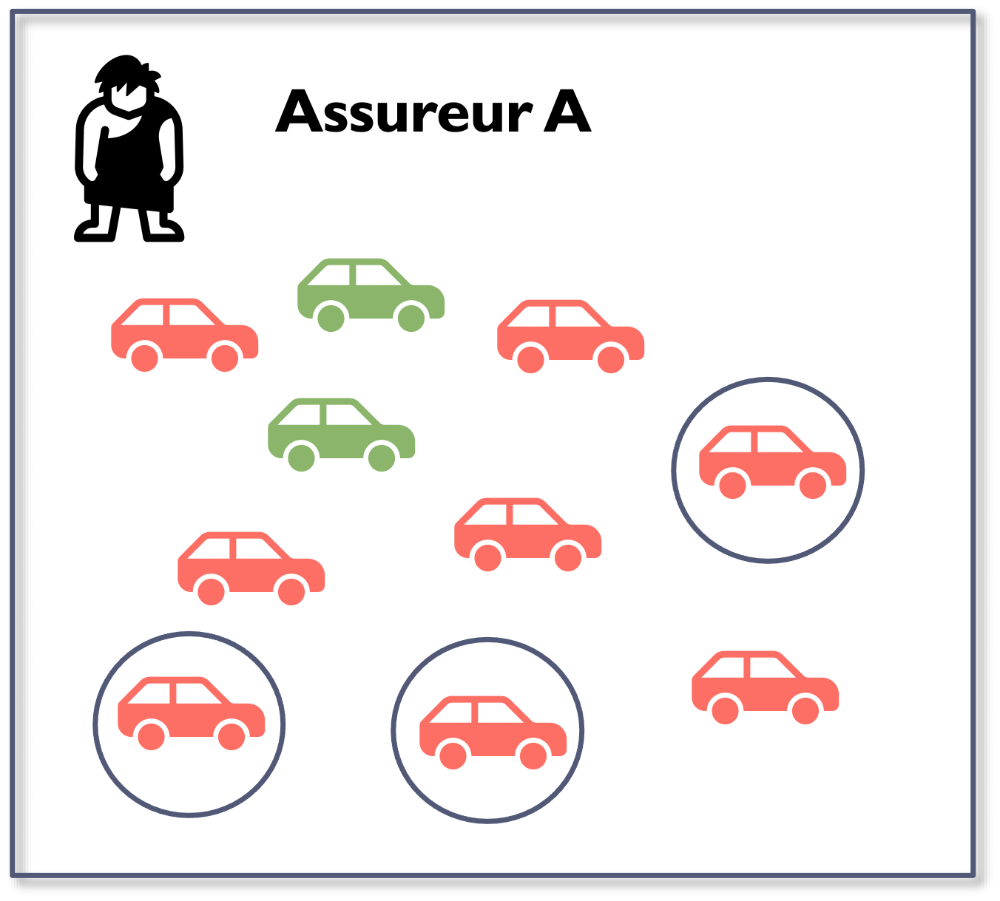
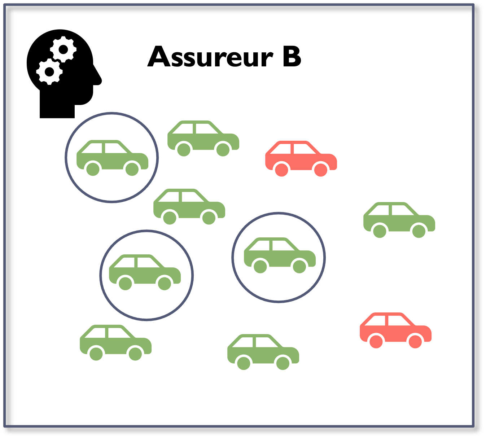
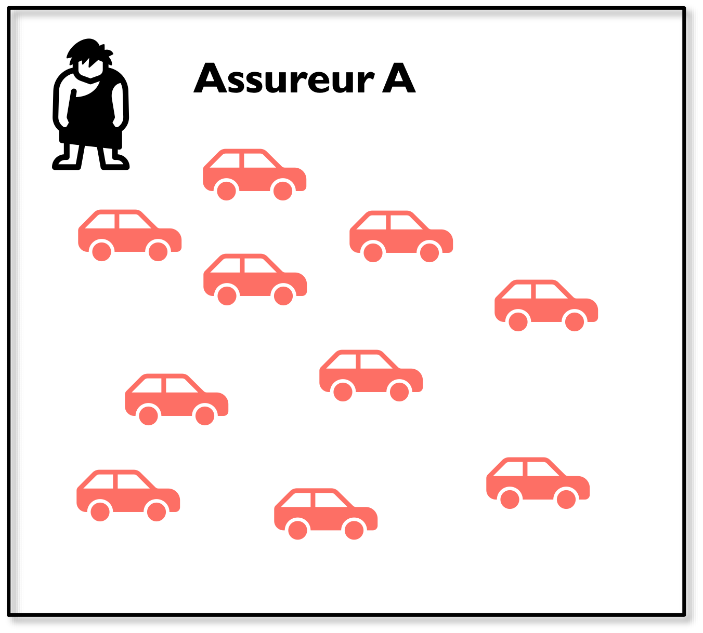

---
format:
  revealjs: default
execute:
  echo: false
metadata-files:
  - ../_diapos.yml
---

```{r}
#| label: setup
#| include: false

library(tarifr)
```

## Lectures recommandées

Ce chapitre est adapté des références suivantes :

- [Actuarial Standard of Practice No. 12, _Risk Classification_](http://www.actuarialstandardsboard.org/wp-content/uploads/2014/02/asop012_132.pdf)
- [Werner, G. et Modlin, C. (2016). _Basic Ratemaking_, Casualty Actuarial Society, 5e édition](http://www.casact.org/library/studynotes/Werner_Modlin_Ratemaking.pdf)

## Contenu du chapitre {.progress-overview}

# Définitions {data-progress-label="Défs"}

## Système de classification des risques


::: {.center}
{width=7% fig-alt="Berline noire."} {width=7% fig-alt="Véhicule tout-terrain."} {width=7% fig-alt="Cabriolet."} {width=7% fig-alt="Voiture de course."}
:::


:::: {.columns}
::: {.column}

**Risques**
: Individus ou compagnies couverts par un système financier (assureur).

**Caractéristiques d’un risque**
: Facteurs ou caractéristiques mesurables ou observables qui sont utilisés pour assigner un risque à une classe de risques dans un système de classification des risques.

:::

::: {.column}

**Classe de risques**
: Sous-ensemble de risques groupés ensemble sous un système de classification des risques.

**Système de classification des risques**
: Système utilisé pour assigner chaque risque à un groupe basé sur les coûts espérés de la couverture fournie.

:::
::::

## Crédibilité vs homogénéité

Une classification des risques cherche à former des groupes qui sont à la fois :

- Suffisamment homogènes pour que les coûts espérés soient comparables
- Suffisamment crédibles pour permettre une estimation précise des coûts

:::: {.columns}
::: {.column}

**Crédibilité**
: Mesure de la valeur prédictive accordée aux données.

:::
::: {.column}

**Homogénéité**
: Degré auquel les résultats espérés dans une classe de risque ont des valeurs comparables.

:::
::::

# Importance des taux équitables {data-progress-label="Taux équitables" subtitle="Information collectée et anti-sélection"}

## Objectifs de la tarification

Balancer l’équation fondamentale en respectant deux considérations :

1. La tarification est prospective.
2. L’équilibre de l’équation doit être atteint au niveau global et au niveau individuel.

:::: {.question title="Soumission d’assurance automobile"}

##

Soumission d'assurance auto sur https://www.clicassure.com/ :

{fig-alt="Formulaire de soumission automobile demandant les renseignements sur le contractant."}

##

{fig-alt="Formulaire de soumission automobile demandant les renseignements sur le conducteur."}

##

{fig-alt="Formulaire de soumission automobile demandant l'identification du véhicule."}

##

{fig-alt="Formulaire de soumission automobile demandant l'utilisation du véhicule."}

##

{fig-alt="Écran d'analyse de la soumission automobile présentant les protections et les primes offertes."}

::: {.notes}
Trois primes proposées chez trois assureurs différents : 483 $, 647 $ et 951 $.
:::

::::

## Exemples de questions pour une soumission {.text-small}

:::: {.columns}
::: {.column width="33%"}
- Le contractant
  - Nom
  - Courriel
  - Adresse de correspondance
  - Numéro de téléphone
  - Date de renouvellement
:::
::: {.column width="33%"}
- Les conducteurs
  - Nom
  - Date de naissance
  - Genre
  - État civil
  - Niveau de scolarité
  - Occupation
  - Antécédents judiciaires
  - Dossier de crédit
  - Historique d'assurance
  - Suspensions de permis
  - Contraventions
  - Expérience de conduite
  - Réclamations
:::
::: {.column width="33%"}
- Le véhicule
  - Marque, modèle, année
  - Valeur actuelle approximative
  - Loué ou acheté
  - Utilisation
  - Kilométrage
  - Distance au travail
  - Stationnement
  - Modifications au véhicule (réparations, performance, esthétique)
  - Antivol
  - Conduite hors province
  - Garanties sélectionnées
:::
::::


## Importance de taux équitables

- Une compagnie qui échoue à charger le taux propre à chaque assuré lorsque les autres compagnies le font s’expose à de l’anti-sélection.
- Une compagnie qui reflète une caractéristique de risque valide alors que les autres ne le font pas peut faire une sélection favorable des risques ou avoir un avantage compétitif.

## Anti-sélection

Supposons un marché où il y a :

:::: {.columns}
::: {.column}
Deux catégories d’assurés qui représentent 50 % de la population chacune :

::: {.table-list .no-borders-table-list}

|  |  |
|:--|:--|
| {width=72px fig-alt=""} | **« Risques élevés »** : $E[\text{perte}] = 200$ |
| {width=72px fig-alt=""} | **« Risques faibles »** : $E[\text{perte}] = 100$ |

:::

:::

::: {.column}
Deux compagnies d’assurance :

::: {.table-list .no-borders-table-list}

|  |  |
|:--|:--|
| {width=72px fig-alt=""} | **Assureur A** : Tarification simple : prime unique de 150 $ pour tous |
| {width=72px fig-alt=""} | **Assureur B** : Tarification segmentée : Prime de 200 $ pour les risques élevés et de 100 $ pour les risques faibles |

:::
:::
::::


---

**Hypothèses**

- Aucun frais ($F = V = 0$)
- Profit cible nul ($Q_T = 0$ %) pour les deux compagnies

## Anti-sélection {.text-xs}

À $T = 0$, chaque assureur reçoit 5 risques élevés et 5 risques faibles.

:::: {.columns .center}
::: {.column}

{width=65% fig-alt="Portefeuille initial de l'assureur A composé de cinq risques faibles en vert et de cinq risques élevés en rouge."}

$$
\begin{aligned}
E[\text{perte}] &= \frac{5 \times 200 + 5 \times 100}{10} = 150 \\
E[\text{profit}] &= 10 \times 150 - 10 \times 150 = 0
\end{aligned}
$$

:::
::: {.column}

{width=65% fig-alt="Portefeuille initial de l'assureur B composé de cinq risques faibles en vert et de cinq risques élevés en rouge."}

$$
\begin{aligned}
E[\text{perte}] &= \frac{5 \times 200 + 5 \times 100}{10} = 150 \\
E[\text{profit}] &= 5 \times 100 + 5 \times 200 - 10 \times 150 = 0
\end{aligned}
$$

:::
::::

---

À $T = 1$ (renouvellement), certains clients magasinent et se fient au prix dans la sélection de leur assureur.

:::: {.columns .center}
::: {.column}

{width=65% fig-alt="Chez l'assureur A, trois risques faibles sont encerclés parmi les dix véhicules du portefeuille initial."}

$$
\begin{aligned}
E[\text{perte}] &= \frac{8 \times 200 + 2 \times 100}{10} = 180 \\
E[\text{profit}] &= 10 \times 150 - 10 \times 180 = \textbf{-300}
\end{aligned}
$$

:::
::: {.column}

{width=65% fig-alt="Chez l'assureur B, trois risques élevés sont encerclés parmi les dix véhicules du portefeuille initial."}

$$
\begin{aligned}
E[\text{perte}] &= \frac{2 \times 200 + 8 \times 100}{10} = 120 \\
E[\text{profit}] &= 8 \times 100 + 2 \times 200 - 10 \times 120 = 0
\end{aligned}
$$

:::
::::

---

À l’ultime, les risques faibles seront tous assurés chez l’assureur B et les risques élevés seront tous assurés chez l’assureur A.

:::: {.columns .center}
::: {.column}

{width=65% fig-alt="Portefeuille final de l'assureur A composé uniquement de dix risques élevés."}

:::
::: {.column}

{width=65% fig-alt="Portefeuille final de l'assureur B composé uniquement de dix risques faibles."}

:::
::::

Si l’assureur A veut rencontrer son profit cible de 0 %, il devra charger 200 $ aux risques élevés à l’ultime.

## Sélection favorable des risques

Lorsqu’une compagnie identifie une caractéristique qui impacte le potentiel de perte et qui n’est pas utilisée par les compétiteurs, elle peut :

1. Implanter la variable de tarification dans son algorithme de tarification, ce qui créera l’effet opposé à l’anti-sélection.
2. Utiliser la caractéristique dans la souscription des assurés ou dans les offensives marketing (« *skimming the cream* »).

En attirant une clientèle plus profitable, la compagnie présentera de meilleurs résultats. Elle pourra éventuellement diminuer son niveau de taux global et ainsi gagner en compétitivité.

::: {.notes}
Un signe que la compagnie est victime d’anti-sélection est une croissance dans un segment non rentable. Pour régler le problème, il ne suffit pas d’augmenter les primes du segment visé : il faut réussir à trouver la distinction entre les risques faibles et les risques élevés.
:::

<!-- ICI -->

# Critères d’évaluation des variables de tarification {data-progress-label="Critères" subtitle="Critères statistiques, opérationnels, sociaux et légaux"}

## Critères d’évaluation des variables de tarification

Plusieurs critères servent à évaluer si une variable de tarification est appropriée. Ces critères peuvent être groupés en quatre catégories :

- Statistique
- Opérationnel
- Social
- Légal

## Statistique {.english-subtitle subtitle="Statistical Criteria"}

**Différence statistique significative**
: L’espérance des coûts devrait varier parmi les différents niveaux de la variable de tarification et la différence devrait se situer dans un intervalle de confiance statistique.  
La différence entre les niveaux devrait être relativement stable d’une année à l’autre.

**Homogénéité**
: Les différents niveaux de la variable devraient représenter des groupes distincts de risques avec des coûts espérés similaires.

**Crédibilité**
: Le nombre de risques dans chaque groupe devrait être suffisamment élevé pour que l’actuaire puisse estimer les coûts de façon précise.

::: {.notes}
Illustrer la différence statistique significative avec l’exemple des hommes et des femmes en assurance automobile.
:::

## Opérationnel {.english-subtitle subtitle="Operational Criteria"}

:::: {.columns}
::: {.column}

**Objective**
: Les niveaux de variable doivent présenter des définitions objectives et non ambiguës.

**Peu coûteuse à administrer**
: Le coût d’obtenir l’information permettant de bien classifier le risque ne devrait pas être trop élevé versus le gain en précision de tarification.

:::
::: {.column}

**Vérifiable**
: La variable ne devrait pas être facilement manipulable par l’assuré, l’agent ou le courtier.

:::
::::

::: {.notes}
Exemples : la responsabilité pour les chirurgiens devrait varier selon le niveau d’habileté du chirurgien, mais cette information est subjective. On utilisera plutôt le nombre d’années d’expérience comme variable indirecte. En assurance habitation, le type de construction est coûteux à vérifier par inspection. Le kilométrage annuel est difficile à estimer et à vérifier.
:::

## Social {.english-subtitle subtitle="Social Criteria"}

:::: {.columns}
::: {.column}

**Prime abordable**
: D’un point de vue social, il est désirable que l’assurance soit abordable pour tous les assurés, en particulier dans un contexte où l’assurance est obligatoire.

**Causalité**
: Lien de cause à effet entre la variable et les coûts espérés. Par exemple, la prime augmente avec le kilométrage annuel puisque la probabilité d’avoir une collision augmente.

:::
::: {.column}

**Contrôlabilité**
: L’assuré a le contrôle sur la classe à laquelle il appartient. Par exemple, un rabais en assurance habitation peut être accordé pour l’installation de dispositifs détectant les fuites.

**Respect de la vie privée**
: Ex : L’assuré peut être inconfortable avec la télématique en assurance automobile qui permet de savoir où se trouve son véhicule à tout moment.

:::
::::

## Légal {.english-subtitle subtitle="Legal Criteria"}

Certaines provinces ou certains États empêchent l’utilisation de certaines variables de tarification.

Par exemple, l’utilisation de la cote de crédit pour la tarification ou la souscription en assurance automobile est interdite en Ontario et à Terre-Neuve-et-Labrador.

::: {.aside}
Sources :  
[Autorité ontarienne de réglementation des services financiers](https://www.fsrao.ca/fr/pour-le-secteur/assurance-automobile/cadre-de-reglementation/lignes-directrices-assurance-automobile/revue-annuelle-de-lontario-visant-les-vehicules-de-tourisme-fondee-sur-les-donnees-de-lindustrie-au-31-decembre-2023) et  
[Board of Commissioners of Public Utilities de Terre-Neuve-et-Labrador](https://www.pub.nf.ca/AutoInsurance/QA/AI_faq15.php)
:::

## {.remember-slide}

Une variable de tarification appropriée satisfait des critères :

- Statistiques (différence significative, homogénéité et crédibilité)
- Opérationnels (objectifs, peu coûteux à administrer et vérifiables)
- Sociaux (prime abordable, causalité, contrôlabilité et respect de la vie privée)
- Légaux

# Détermination des différentiels indiqués {data-progress-label="Différentiels indiqués" subtitle="Comparer les coûts projetés entre les niveaux d'une variable"}

## Détermination des différentiels indiqués

Une fois les variables de tarification déterminées, l’actuaire doit sélectionner des différentiels (ou relativités) associés à chaque niveau de la variable de tarification.

:::: {.question title="Algorithme de tarification en assurance habitation"}

##

Exemple simplifié :

::: {.text-smaller}
$$
\begin{align}
\text{Prime} = &\text{ Prime de base} \times \text{Différentiel région} \times \text{Différentiel fumeur} \\
&+ \text{Frais fixe par unité}
\end{align}
$$
:::

La prime de base est de 1 000 $ et les frais fixes sont de 100 $.

:::: {.columns}

::: {.column width="50%"}

| Région | Différentiel |
|:--|--:|
| Montréal | 1,5 |
| Beauce | 0,9 |
| Québec | 1,1 |
| Autre | 1,0 |

:::

::: {.column width="50%"}

| Fumeur | Différentiel |
|:--|--:|
| Oui | 1,2 |
| Non | 1,0 |

La classe de base est **Région autre, non-fumeur**.

:::

::::


::::

## Détermination des différentiels indiqués

Trois approches permettent de déterminer les différentiels indiqués avec les méthodes traditionnelles :

- Prime pure
- Taux de sinistre
- Prime pure ajustée


## Approche de la prime pure {.english-subtitle subtitle="Pure Premium Approach"}

Rappel du chapitre 8 :

$$
\text{Prime moyenne indiquée} = \overline{P_I} = \frac{\overline{L + E_L} + \overline{E_F}}{1 - V - Q_T}
$$

---

Pour une variable de tarification $R1$, avec des différentiels pour chaque niveau $R1_i$, le différentiel par rapport à la classe de base $B$ est :

$$
R1_{I,i} =
\frac{\overline{P_{I, i}}}
{\overline{P_{I, B}}} = 
\frac{\left[\dfrac{\overline{L + E_L} + \overline{E_F}}
{1 - V - Q_T}\right]_i}
{\left[\dfrac{\overline{L + E_L} + \overline{E_F}}
{1 - V - Q_T}\right]_B}
$$

::: {.text-small}
Par exemple, dans l'exemple précédent, si la variable $R1$ est la région, alors $R1_{I,i}$ est le différentiel indiqué pour la région $i$ (Montréal, Beauce, Québec, ou Autre) par rapport à la classe de base « Région autre ». Le différentiel pour Montréal serait $R1_{I, Mtl} = \frac{\overline{P_{I, Mtl}}}{\overline{P_{I, Autre}}}$.
:::

---

En assumant que tous les frais de souscription sont variables ($\overline{E_F} = 0$) :

$$
R1_{I,i} =
\frac{\left[\dfrac{\overline{L + E_L}}
{1 - V - Q_T}\right]_i}
{\left[\dfrac{\overline{L + E_L}}
{1 - V - Q_T}\right]_B}
$$

---

En assumant que toutes les unités ont les mêmes frais de souscription et le même profit cible :

$$
R1_{I,i} =
\frac{\left(\overline{L + E_L}\right)_i}
{\left(\overline{L + E_L}\right)_B}
$$

---

Le différentiel indiqué pour un niveau de variable est la prime pure projetée ultime, incluant les frais de règlement de sinistres, pour ce niveau divisée par la prime pure projetée ultime, incluant les frais de règlement de sinistres, de la classe de base.

:::: {.columns}
::: {.column width="58%"}

$$
R1_{I,i} =
\frac{\left(\overline{L + E_L}\right)_i}
{\left(\overline{L + E_L}\right)_B}
$$

:::
::: {.column width="42%"}

::: {.callout-warning title="Attention" .text-xs}
Le numérateur et le dénominateur doivent être au niveau projeté et ultime.
:::

:::
::::

::: {.text-small}
Donc, si toutes les hypothèses simplificatices sont satisfaites, le différentiel indiqué pour la région Montréal, $R1_{I, Mtl}$, est la prime pure projetée ultime pour Montréal divisée par la prime pure projetée ultime pour la région de base « Autre ».
:::

::::: {.question title="Différentiels par territoire"}

## {.text-small}

Avec les données suivantes en assurance habitation, calculer les différentiels indiqués par territoire selon la méthode de la prime pure. La base est le territoire 2.

```{r}
#| label: chapitre9-donnees-exemple-territoires
#| include: false

unites_montant <- data.frame(
  `Montant d’assurance` = c("Faible", "Moyen", "Élevé", "Total"),
  `Territoire 1` = c(7, 108, 179, 294),
  `Territoire 2` = c(130, 126, 129, 385),
  `Territoire 3` = c(143, 126, 40, 309),
  Total = c(280, 360, 348, 988),
  check.names = FALSE
)

experience_cellules <- data.frame(
  montant = rep(c("Faible", "Moyen", "Élevé"), 3),
  territoire = rep(1:3, each = 3),
  unites = c(7, 108, 179, 130, 126, 129, 143, 126, 40),
  sinistres = c(210.93, 4458.05, 10565.98, 6206.12, 8239.95, 12063.68,
                8441.25, 10188.70, 4625.34),
  primes = c(335.99, 6479.87, 14498.71, 10399.79, 12599.75, 17414.65,
             14871.70, 16379.68, 7019.86)
)

relativites_montant <- c(Faible = 0.8, Moyen = 1, Élevé = 1.35)
relativites_territoire <- c(`1` = 0.6, `2` = 1, `3` = 1.3)
relativites_reelles_montant <- c(Faible = 0.73, Moyen = 1, Élevé = 1.43)
relativites_reelles_territoire <- c(`1` = 0.6312, `2` = 1, `3` = 1.2365)

totaux_territoire <- aggregate(
  cbind(unites, sinistres, primes) ~ territoire,
  data = experience_cellules,
  FUN = sum
)
experience_avec_montant <- transform(
  experience_cellules,
  relativite_montant = unname(relativites_montant[montant])
)
experience_avec_montant$unites_ponderees <- experience_avec_montant$unites *
  experience_avec_montant$relativite_montant
moyenne_montant <- aggregate(
  unites_ponderees ~ territoire,
  data = experience_avec_montant,
  FUN = sum
)
unites_territoire <- aggregate(unites ~ territoire, data = experience_avec_montant, FUN = sum)
moyenne_montant$relativite_moyenne <- round(
  moyenne_montant$unites_ponderees / unites_territoire$unites,
  4
)

territoire_stats <- totaux_territoire[order(totaux_territoire$territoire), ]
territoire_stats$prime_pure <- territoire_stats$sinistres / territoire_stats$unites
territoire_stats$relativite_prime_pure <- territoire_stats$prime_pure /
  territoire_stats$prime_pure[territoire_stats$territoire == 2]
territoire_stats$taux_sinistre <- territoire_stats$sinistres / territoire_stats$primes
territoire_stats$facteur_taux_sinistre <- round(territoire_stats$taux_sinistre, 3) /
  round(territoire_stats$taux_sinistre[territoire_stats$territoire == 2], 3)
territoire_stats$relativite_actuelle <- unname(relativites_territoire[as.character(territoire_stats$territoire)])
territoire_stats$relativite_taux_sinistre <- territoire_stats$facteur_taux_sinistre *
  territoire_stats$relativite_actuelle
territoire_stats$relativite_moyenne_montant <- moyenne_montant$relativite_moyenne
territoire_stats$unites_ajustees <- territoire_stats$unites *
  territoire_stats$relativite_moyenne_montant
territoire_stats$prime_pure_ajustee <- territoire_stats$sinistres /
  territoire_stats$unites_ajustees
territoire_stats$relativite_prime_pure_ajustee <- signif(
  territoire_stats$prime_pure_ajustee /
    territoire_stats$prime_pure_ajustee[territoire_stats$territoire == 2],
  4
)

territoire_total <- data.frame(
  territoire = NA_integer_,
  unites = sum(territoire_stats$unites),
  sinistres = sum(territoire_stats$sinistres),
  primes = sum(territoire_stats$primes),
  prime_pure = sum(territoire_stats$sinistres) / sum(territoire_stats$unites),
  relativite_prime_pure = (sum(territoire_stats$sinistres) / sum(territoire_stats$unites)) /
    territoire_stats$prime_pure[territoire_stats$territoire == 2],
  taux_sinistre = sum(territoire_stats$sinistres) / sum(territoire_stats$primes),
  facteur_taux_sinistre = (sum(territoire_stats$sinistres) / sum(territoire_stats$primes)) /
    round(territoire_stats$taux_sinistre[territoire_stats$territoire == 2], 3),
  relativite_actuelle = NA_real_,
  relativite_taux_sinistre = NA_real_,
  relativite_moyenne_montant = NA_real_,
  unites_ajustees = sum(territoire_stats$unites_ajustees),
  prime_pure_ajustee = sum(territoire_stats$sinistres) / sum(territoire_stats$unites_ajustees),
  relativite_prime_pure_ajustee = signif(
    (sum(territoire_stats$sinistres) / sum(territoire_stats$unites_ajustees)) /
      territoire_stats$prime_pure_ajustee[territoire_stats$territoire == 2],
    4
  )
)
territoire_stats_complet <- rbind(territoire_stats, territoire_total)
territoire_stats_complet$territoire_label <- c("1", "2 (base)", "3", "Total")

tableau_relativites_montant <- data.frame(
  `Montant d’assurance` = names(relativites_montant),
  `Relativité réelle` = unname(relativites_reelles_montant),
  `Relativité chargée` = unname(relativites_montant),
  check.names = FALSE
)
tableau_relativites_territoire <- data.frame(
  Territoire = names(relativites_territoire),
  `Relativité réelle` = unname(relativites_reelles_territoire),
  `Relativité chargée` = unname(relativites_territoire),
  check.names = FALSE
)
tableau_territoire_prime_pure <- data.frame(
  Territoire = territoire_stats_complet$territoire_label,
  Unités = territoire_stats_complet$unites,
  `Sinistres et frais de règlement de sinistres` = territoire_stats_complet$sinistres,
  `Prime pure` = territoire_stats_complet$prime_pure,
  `Différentiel indiqué` = territoire_stats_complet$relativite_prime_pure,
  check.names = FALSE
)
tableau_territoire_taux_sinistre <- data.frame(
  Territoire = territoire_stats_complet$territoire_label,
  `Primes au taux courant` = territoire_stats_complet$primes,
  `Sinistres et frais de règlement de sinistres` = territoire_stats_complet$sinistres,
  `Taux de sinistre` = territoire_stats_complet$taux_sinistre,
  `Facteur de changement` = territoire_stats_complet$facteur_taux_sinistre,
  `Différentiel actuel` = territoire_stats_complet$relativite_actuelle,
  `Différentiel indiqué` = territoire_stats_complet$relativite_taux_sinistre,
  check.names = FALSE
)
tableau_question_taux_sinistre <- tableau_territoire_taux_sinistre[, c(1:3, 6)]
tableau_comparaison <- data.frame(
  Territoire = territoire_stats_complet$territoire_label[1:3],
  `Relativité réelle` = unname(relativites_reelles_territoire),
  `Méthode de la prime pure` = territoire_stats$relativite_prime_pure,
  `Méthode du taux de sinistre` = territoire_stats$relativite_taux_sinistre,
  `Méthode de la prime pure ajustée` = territoire_stats$relativite_prime_pure_ajustee,
  check.names = FALSE
)
tableau_ajustement_montant <- data.frame(
  `Montant d’assurance` = unites_montant[[1]],
  `Relativité chargée` = c(unname(relativites_montant), NA_real_),
  `Territoire 1` = unites_montant[[2]],
  `Territoire 2` = unites_montant[[3]],
  `Territoire 3` = unites_montant[[4]],
  check.names = FALSE
)
tableau_ajustement_montant <- rbind(
  tableau_ajustement_montant,
  data.frame(
    `Montant d’assurance` = "Relativité moyenne par montant d’assurance",
    `Relativité chargée` = NA_real_,
    `Territoire 1` = territoire_stats$relativite_moyenne_montant[1],
    `Territoire 2` = territoire_stats$relativite_moyenne_montant[2],
    `Territoire 3` = territoire_stats$relativite_moyenne_montant[3],
    check.names = FALSE
  )
)
tableau_question_prime_pure_ajustee <- tableau_ajustement_montant[1:4, ]
tableau_sinistres_territoire <- tableau_territoire_prime_pure[, c(1, 3)]
tableau_prime_pure_ajustee <- data.frame(
  Territoire = territoire_stats_complet$territoire_label,
  Unités = territoire_stats_complet$unites,
  `Différentiel moyen par montant d’assurance` = territoire_stats_complet$relativite_moyenne_montant,
  `Unités d’exposition ajustées` = territoire_stats_complet$unites_ajustees,
  `Sinistres et frais de règlement de sinistres` = territoire_stats_complet$sinistres,
  `Prime pure ajustée` = territoire_stats_complet$prime_pure_ajustee,
  `Différentiel indiqué` = territoire_stats_complet$relativite_prime_pure_ajustee,
  check.names = FALSE
)
```

```{r}
#| label: chapitre9-distribution-table
#| output: asis

afficher_table(
  unites_montant,
  align = c("l", rep("r", 4)),
  formats = list(list(colonnes = 2:5, type = "nombre", digits = 0)),
  lignes_gras = "derniere",
  entetes_groupes = list(list(label = "Distribution des unités", colonnes = 2:4))
)
```

**Remarques**

- 61 % ($179 / 294$) des unités du territoire 1 ont des montants d’assurance élevés.
- Seulement 12 % ($40 / 309$) des unités du territoire 3 ont des montants d’assurance élevés.

##

Relativités réelles et relativités chargées :

:::: {.columns}
::: {.column}

```{r}
#| label: chapitre9-relativites-montant-table
#| output: asis

afficher_table(
  tableau_relativites_montant,
  align = c("l", "r", "r"),
  formats = list(list(colonnes = 2:3, type = "nombre", digits = 4))
)
```

:::
::: {.column}

```{r}
#| label: chapitre9-relativites-territoire-table
#| output: asis

afficher_table(
  tableau_relativites_territoire,
  align = c("l", "r", "r"),
  formats = list(list(colonnes = 2:3, type = "nombre", digits = 4))
)
```

:::
::::

::: {.text-small}
Note : La relativité réelle n’est pas connue et c’est ce qu’on cherche à trouver. La relativité chargée est celle actuellement utilisée pour le calcul de la prime.
:::

##

Expérience par montant d’assurance et territoire :

```{r}
#| label: chapitre9-experience-table
#| output: asis

experience_affichage <- experience_cellules
experience_affichage$territoire <- paste("Territoire", experience_affichage$territoire)
names(experience_affichage) <- c(
  "Montant d’assurance", "Territoire", "Unités",
  "Sinistres et frais de règlement de sinistres", "Primes au taux courant"
)
experience_affichage <- rbind(
  experience_affichage,
  data.frame(
    `Montant d’assurance` = "Total",
    Territoire = "",
    Unités = sum(experience_cellules$unites),
    `Sinistres et frais de règlement de sinistres` = sum(experience_cellules$sinistres),
    `Primes au taux courant` = sum(experience_cellules$primes),
    check.names = FALSE
  )
)

afficher_table(
  experience_affichage,
  align = c("l", "l", "r", "r", "r"),
  formats = list(
    list(colonnes = 3, type = "nombre", digits = 0),
    list(colonnes = 4:5, type = "montant", symbole = TRUE)
  ),
  lignes_gras = "derniere"
)
```

::: {.solution}

## {.text-xs}

Pour chaque territoire, la prime pure et le différentiel indiqué sont :

$$
P_i = \frac{\left(L + E_L\right)_i}{X_i}
\qquad
R1_{I,i} = \frac{P_i}{P_B}
$$

```{r}
#| label: chapitre9-prime-pure-table
#| output: asis

afficher_table(
  tableau_territoire_prime_pure,
  align = c("l", "r", "r", "r", "r"),
  formats = list(
    list(colonnes = 2, type = "nombre", digits = 0),
    list(colonnes = 3:4, type = "montant", symbole = TRUE),
    list(colonnes = 5, type = "nombre", digits = 4)
  ),
  lignes_gras = "derniere",
  entetes_calculs = c(
    "(1)",
    "(2)",
    "(3)",
    "(4) = (3) / (2)",
    "(5) = (4) / (4) du territoire 2"
  )
)
```

Exemple de calcul pour le territoire 1 :

$$
\begin{aligned}
7 + 108 + 179 &= 294 \\
210.93 + 4\,458.05 + 10\,565.98 &= 15\,234.96 \\
15\,234.96 / 294 &= 51.82 \\
51.82 / 68.86 &= 0.7525
\end{aligned}
$$

:::

:::::

## Approche de la prime pure

```{r}
#| label: chapitre9-comparaison-prime-pure-table
#| output: asis

comparaison_prime_pure <- tableau_comparaison[, 1:3]
names(comparaison_prime_pure) <- c("Territoire", "Réelle", "Prime pure")

afficher_table(
  comparaison_prime_pure,
  align = c("l", "r", "r"),
  formats = list(list(colonnes = 2:3, type = "nombre", digits = 4))
)
```

La prime pure pour chaque niveau est basée sur l’expérience de chaque niveau et assume une distribution uniforme des unités selon les autres variables de tarification.

En ignorant la corrélation entre les variables de territoire et de montant d’assurance, l’expérience des montants d’assurance élevés ou bas peut résulter en une distorsion des différentiels indiqués et en un « double-comptage ».

---

```{r}
#| label: chapitre9-comparaison-prime-pure-table2
#| output: asis

afficher_table(
  comparaison_prime_pure,
  align = c("l", "r", "r"),
  formats = list(list(colonnes = 2:3, type = "nombre", digits = 4))
)
```

La relativité obtenue pour le territoire 1, qui contient une plus grande proportion d’unités avec un montant d’assurance élevé, est surévaluée par rapport à sa relativité réelle.

La relativité obtenue pour le territoire 3, qui contient une plus grande proportion d’unités avec un montant d’assurance faible, est sous-évaluée par rapport à sa relativité réelle.

::: {.notes}
Donner un exemple de distorsion et expliquer l’effet de la corrélation entre les variables de territoire et de montant d’assurance.
:::

## Approche du taux de sinistre {.english-subtitle subtitle="Loss Ratio Approach" .text-small}

La méthode du taux de sinistre produit un changement de différentiel indiqué en comparant le taux de sinistre du niveau $i$ par rapport au taux de sinistre de la classe de base :

$$
\text{Facteur de changement de différentiel indiqué pour le niveau } i = \\
\frac{R1_{I,i}}{R1_{C,i}}
=
\frac{\left[\left(L + E_L\right) / P_C\right]_i}
{\left[\left(L + E_L\right) / P_C\right]_B}
$$

Où :

- $R1_{C,i}$ est le différentiel courant pour le niveau $i$ de la variable $R1$.
- $P_{C,i}$ sont les primes au taux courant pour le niveau $i$ de la variable $R1$.
- $P_{C,B}$ sont les primes au taux courant pour la classe de base de la variable $R1$.

:::: {.question title="Différentiels, méthode du taux de sinistre"}

##

Avec les données de l’exemple précédent, calculer le facteur de changement du différentiel indiqué et le différentiel indiqué pour chaque territoire. La base est le territoire 2.

::: {.solution}

##

Le facteur de changement et le différentiel indiqué sont :

$$
F_i =
\frac{\left[\left(L + E_L\right) / P_C\right]_i}
{\left[\left(L + E_L\right) / P_C\right]_B}
\qquad
R1_{I,i} = F_i \times R1_{C,i}
$$

```{r}
#| label: chapitre9-taux-sinistre-table
#| output: asis

afficher_table(
  tableau_territoire_taux_sinistre,
  align = c("l", rep("r", 6)),
  formats = list(
    list(colonnes = 2:3, type = "montant", symbole = TRUE),
    list(colonnes = 4, type = "pourcentage", digits = 1),
    list(colonnes = 5:7, type = "nombre", digits = 4)
  ),
  lignes_gras = "derniere",
  entetes_calculs = c(
    "(1)",
    "(2)",
    "(3)",
    "(4) = (3) / (2)",
    "(5) = (4) / (4) du territoire 2",
    "(6)",
    "(7) = (5) × (6)"
  )
)
```

##

Exemple de calcul pour le territoire 1 :

$$
\begin{aligned}
335.99 + 6\,479.87 + 14\,498.71 &= 21\,314.57 \\
210.93 + 4\,458.05 + 10\,565.98 &= 15\,234.96 \\
15\,234.96 / 21\,314.57 &= 71.5\,\% \\
71.5\,\% / 65.6\,\% &= 1.0899 \\
1.0899 \times 0.6000 &= 0.6540
\end{aligned}
$$

:::

::::

## Approche du taux de sinistre

```{r}
#| label: chapitre9-comparaison-taux-sinistre-table
#| output: asis

comparaison_taux_sinistre <- tableau_comparaison[, 1:4]
names(comparaison_taux_sinistre) <- c(
  "Territoire", "Réelle", "Prime pure", "Taux de sinistre"
)

afficher_table(
  comparaison_taux_sinistre,
  align = c("l", "r", "r", "r"),
  formats = list(list(colonnes = 2:4, type = "nombre", digits = 4))
)
```

Comme on utilise la prime au dénominateur dans l’approche du taux de sinistre, cela aide à ajuster pour le biais des montants d’assurance.


## Approche de la prime pure ajustée {.english-subtitle subtitle="Adjusted Pure Premium Approach"}

Ajustement à l’approche de la prime pure dans le but de limiter l’impact des biais dans la distribution :

- On ajuste les unités par le différentiel moyen pour toutes les autres variables
- On calcule ensuite la prime pure avec les unités d’exposition ajustées plutôt qu’avec les unités réelles

:::: {.question title="Différentiels, méthode de la prime pure ajustée"}

##

Avec les données de l’exemple précédent, calculer les différentiels indiqués avec la méthode de la prime pure ajustée. La base est le territoire 2.

:::: {.columns}
::: {.column width="62%"}

```{r}
#| label: chapitre9-question-prime-pure-ajustee-table
#| output: asis

afficher_table(
  tableau_question_prime_pure_ajustee,
  align = c("l", rep("r", 4)),
  formats = list(
    list(colonnes = 2, type = "nombre", digits = 4),
    list(colonnes = 3:5, type = "nombre", digits = 0)
  ),
  lignes_gras = "derniere",
  entetes_groupes = list(list(label = "Unités par territoire", colonnes = 3:5))
)
```

:::
::: {.column width="38%"}

```{r}
#| label: chapitre9-question-sinistres-territoire-table
#| output: asis

afficher_table(
  tableau_sinistres_territoire,
  align = c("l", "r"),
  formats = list(list(colonnes = 2, type = "montant", symbole = TRUE)),
  lignes_gras = "derniere"
)
```

:::
::::

::: {.solution}

## {.text-small}

Pour chaque territoire, on ajuste les unités par la relativité moyenne des autres variables :

### Étape 1 : Différentiel moyen par montant d’assurance

```{r}
#| label: chapitre9-ajustement-montant-table
#| output: asis

afficher_table(
  tableau_ajustement_montant,
  align = c("l", rep("r", 4)),
  formats = list(
    list(colonnes = 2:5, type = "nombre", digits = 4)
  ),
  lignes_gras = "derniere",
  entetes_groupes = list(list(label = "Unités par territoire", colonnes = 3:5))
)
```

Exemple de calcul : $\frac{7 \times 0.8 + 108 \times 1 + 179 \times 1.35}{294} = 1.2083$

##

### Étape 2 : Unités d’exposition ajustées

:::: {.columns}
::: {.column}
$$
X_t^{\text{ajustées}} = X_t \bar{R}_{\text{montant},t}
$$
:::
::: {.column}
$$
\begin{aligned}
294 \times 1.2083 &= 355.24 \\
385 \times 1.0497 &= 404.13 \\
309 \times 0.9528 &= 294.42
\end{aligned}
$$
:::
::::


## {.text-smaller}

### Étape 3 : Prime pure avec les unités ajustées

Pour appliquer la méthode de la prime pure aux unités ajustées :

$$
P_t^{\text{ajustée}} = \frac{\left(L + E_L\right)_t}{X_t^{\text{ajustées}}}
\qquad
R1_{I,t} = \frac{P_t^{\text{ajustée}}}{P_B^{\text{ajustée}}}
$$

```{r}
#| label: chapitre9-prime-pure-ajustee-table
#| output: asis

afficher_table(
  tableau_prime_pure_ajustee,
  align = c("l", "r", "r", "r", "r", "r", "r"),
  formats = list(
    list(colonnes = 2, type = "nombre", digits = 0),
    list(colonnes = 3, type = "nombre", digits = 4),
    list(colonnes = 4, type = "nombre", digits = 2),
    list(colonnes = 5:6, type = "montant", symbole = TRUE),
    list(colonnes = 7, type = "nombre", digits = 4)
  ),
  lignes_gras = "derniere",
  entetes_calculs = c(
    "(1)",
    "(2)",
    "(3)",
    "(4) = (2) × (3)",
    "(5)",
    "(6) = (5) / (4)",
    "(7) = (6) / (6) du territoire 2"
  )
)
```

##

Exemple de calcul pour le territoire 1 :

$$
\begin{aligned}
210.93 + 4\,458.05 + 10\,565.98 &= 15\,234.96 \\
15\,234.96 / 355.24 &= 42.89 \\
42.89 / 65.60 &= 0.6538
\end{aligned}
$$

:::

::::

## Approche de la prime pure ajustée

Puisque les différentiels courants par montant d’assurance sont utilisés pour l’ajustement, on obtient essentiellement les mêmes différentiels indiqués qu’avec la méthode du taux de sinistre (à l’arrondissement près). Les mêmes commentaires que ceux sur les distorsions de la méthode du taux de sinistre s’appliquent.

Si on utilisait les différentiels exacts par montant d’assurance pour déterminer notre ajustement, les différentiels indiqués seraient corrects. Ces différentiels ne sont toutefois pas connus.

## {.remember-slide}

Les trois approches ont le même objectif : obtenir un différentiel indiqué à partir d’une expérience projetée et ultime.

- **Prime pure** compare directement les coûts par unité.
- **Taux de sinistre** compare les coûts aux primes au taux courant.
- **Prime pure ajustée** pondère les unités selon les autres variables de tarification.
