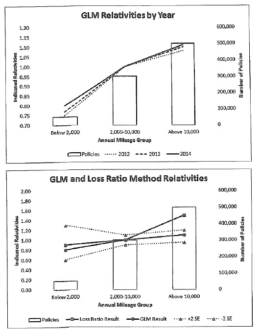
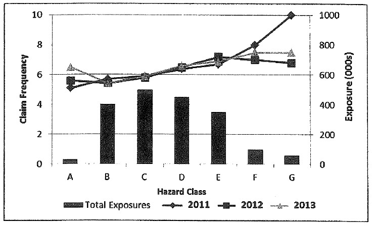
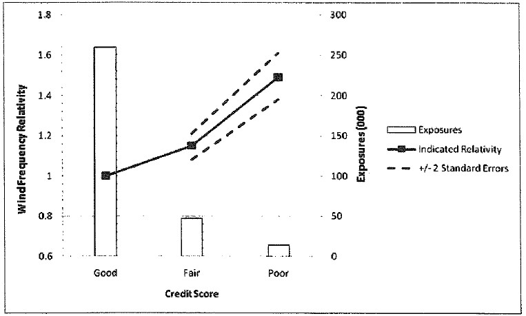
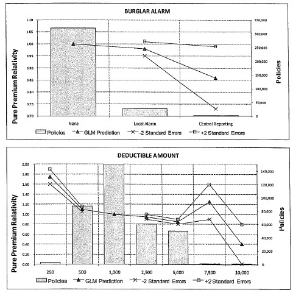
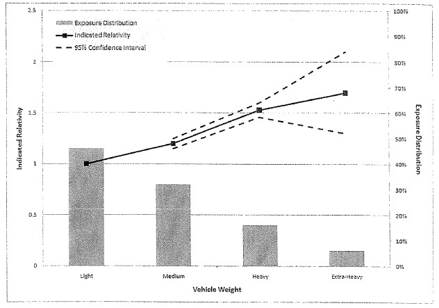
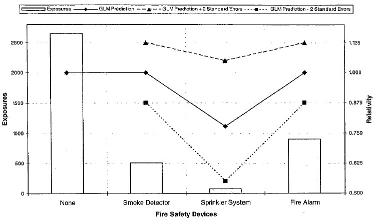
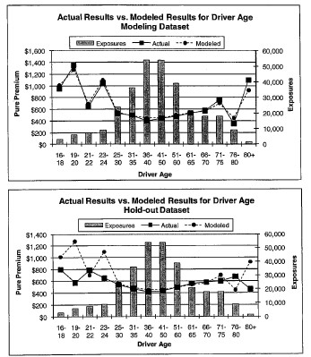

---
metadata-files:
  - ../_exercices.yml
---

<!-- Les figures sont extraites des images intégrées dans le PDF historique chap10-exercices.pdf. -->

::: {.question}
Quels sont les avantages des méthodes de classification multivariées ?

::: {.solution}

1. Les méthodes de classification multivariées considèrent toutes les variables **simultanément** et ajustent automatiquement pour la corrélation entre les variables de tarification.
2. Les méthodes de classification multivariées tentent d’éliminer les effets non systématiques (le bruit) et de capturer seulement les effets systématiques (le signal).
3. Les méthodes de classification multivariées produisent des diagnostics des modèles.
4. Les méthodes de classification multivariées permettent d’inclure une considération pour les **interactions** ou interdépendances entre deux variables ou plus.
:::
:::

:::: {.question}
(CAS Examen 5, Automne 2015 – Q10)

Un assureur automobile a calculé ses différentiels en utilisant la méthode du taux de sinistre et un modèle GLM. Les données des années 2012–2014 ont été utilisées dans les deux analyses. Avec les résultats suivants pour la variable de tarification « kilométrage annuel » :

{width=82% fig-alt="Deux graphiques historiques montrant les différentiels selon trois catégories de kilométrage annuel, les expositions et les résultats des années 2012 à 2014."}

::: {.question}
Discuter si la variable « kilométrage annuel » serait une bonne variable de tarification.

::: {.solution}
La variable « kilométrage annuel » serait une bonne variable de tarification, car :

- Le nombre d’unités d’exposition dans chaque catégorie de kilométrage annuel est relativement élevé, même pour la catégorie à faible kilométrage, qui présente autour de 50 000 unités.
- La variable « kilométrage annuel » présente une différence claire dans les différentiels indiqués. Plus le kilométrage annuel est élevé, plus le différentiel indiqué est élevé, ce qui est intuitif.
- Les différentiels indiqués présentent une stabilité pour les années 2012 à 2014.
- Pour « 2 000–10 000 km » et « 10 000 km et plus » (les deux niveaux avec le plus d’unités), l’intervalle de confiance est assez petit autour de la prédiction du GLM.
:::
:::

::: {.question}
En prenant en considération deux autres critères d’une bonne variable de tarification, discuter si la variable « kilométrage annuel » serait une bonne variable de tarification.

::: {.solution}
Plusieurs réponses sont possibles :

- Le kilométrage annuel serait une bonne variable de tarification, car il est objectif et vérifiable puisqu’il est inscrit à l’odomètre du véhicule.
- Il est intuitif pour un assuré qu’un kilométrage annuel plus élevé signifie plus d’accidents et donc une prime plus élevée. Les assurés accepteraient bien cette variable de tarification, donc ce serait une bonne variable.
- Il est contrôlable : c’est une bonne variable de tarification, car cela encourage les assurés à réduire l’utilisation de leur véhicule et ainsi à diminuer leurs accidents et, par le fait même, leur prime.
:::
:::

::: {.question}
Recommander si l’assureur devrait utiliser la variable « kilométrage annuel » dans son plan de tarification.

::: {.solution}
Puisque les différentiels indiqués sont clairement différents selon le kilométrage annuel et que cette variable est objective, vérifiable et contrôlable, je recommanderais l’implantation de cette variable de tarification.
:::
:::
::::

::: {.question}
(CAS Examen 5, Automne 2014 – Q10a)

Un actuaire réalise une analyse sur la responsabilité civile des fabricants en utilisant un modèle GLM pour la première fois sur ce portefeuille. Les assurés sont catégorisés en classe de risque de A à G. Le graphique suivant montre les données de fréquence de sinistre et les unités par classe de risque :

{width=84% fig-alt="Graphique historique de la fréquence des sinistres, des expositions et des différentiels selon les classes de risque A à G pour les années 2011 à 2013."}

::: {.question}
Évaluer la valeur prédictive de la classe de risque avec l’information fournie plus haut.

::: {.solution}
Mis à part les données des classes A, F et G, on voit clairement une tendance à la hausse dans les différentiels indiqués. Cette tendance semble stable pour chacune des trois années présentées. Pour les classes A, F et G, où la tendance est moins stable dans le temps, le nombre d’unités est relativement faible, ce qui ne disqualifie pas les résultats stables pour les classes B à E. On pourrait regrouper la classe A avec la classe B et les classes F et G ensemble pour pallier ce problème. L’analyse suggère donc que la classe de risque est une variable prédictive. Plus la classe de risque est près de G, plus la fréquence est élevée.
:::
:::
:::

::: {.question}
(CAS Examen 5, Printemps 2014 – Q9)

Un assureur considère utiliser la cote de crédit pour segmenter davantage son portefeuille d’assurance habitation. L’assureur a développé un modèle GLM pour évaluer la contribution de différentes variables à la fréquence espérée des réclamations causées par le vent.

Le graphique suivant montre les résultats d’une analyse nationale faite sur des données annuelles d’un modèle GLM.

{width=84% fig-alt="Graphique historique de la relativité de fréquence des sinistres et de l’exposition selon les cotes de crédit Good, Fair et Poor, avec des bornes d’incertitude."}

En utilisant les résultats du GLM ainsi que d’autres considérations, justifier si l’assureur devrait ajouter la cote de crédit dans son plan de tarification d’assurance habitation pour le péril « vent ».

::: {.solution}
L’analyse GLM montre que la variable de cote de crédit est une variable significative pour la fréquence de réclamation pour les dommages causés par le vent.

On y voit une tendance à la hausse du différentiel indiqué lorsque la cote de crédit est moins bonne.

L’intervalle de ±2 écarts-types est assez près de la relativité indiquée. Pour la cote de crédit « Poor », la relativité indiquée +2 écarts-types et la relativité indiquée −2 écarts-types sont supérieures à la relativité indiquée de la cote de crédit « Fair », ce qui indique que les deux niveaux de cote de crédit sont significativement différents. La cote de crédit « Poor » n’a pas beaucoup de volume (autour de 5 % du volume total) et donc peu de crédibilité. Cela devrait être pris en considération en faisant la sélection des différentiels.

La variable est objective, facile à vérifier et relativement peu coûteuse (donnée non disponible ici). Elle serait donc recommandée d’un point de vue opérationnel.

La cote de crédit est contrôlable par l’assuré. Socialement, cette variable n’est pas toujours bien perçue, car les assurés ont généralement de la difficulté à voir le lien entre la cote de crédit et les sinistres espérés (particulièrement pour des dommages causés par le vent !). Cette variable peut aussi rendre l’assurance moins abordable pour les assurés ayant une mauvaise cote de crédit, qui ne sont peut-être pas dans une bonne position financière pour voir leur prime augmenter drastiquement.
:::
:::

::: {.question}
(CAS Examen 5, Printemps 2013 – Q12)

Un assureur planifie réviser ses différentiels pour un système d’alarme contre le vol et la franchise en assurance habitation. Avec les résultats suivants provenant d’une analyse GLM :

{width=78% fig-alt="Deux graphiques historiques montrant les expositions, les prédictions GLM et les intervalles de confiance pour le système d’alarme et le montant de la franchise."}

| Système d’alarme | Prédiction du GLM | −2 écarts-types | +2 écarts-types | Nb de polices |
|:---|---:|---:|---:|---:|
| Aucun | 1,00 |  |  | 320 000 |
| Système d’alarme local (*local alarm*) | 0,98 | 0,950 | 1,010 | 27 500 |
| Système d’alarme relié à la centrale (*central reporting*) | 0,86 | 0,730 | 0,990 | 2 500 |

| Franchise (*deductible*) | Prédiction du GLM | −2 écarts-types | +2 écarts-types | Nb de polices |
|:---|---:|---:|---:|---:|
| 250 $ | 1,75 | 1,60 | 1,90 | 2 700 |
| 500 $ | 1,10 | 1,05 | 1,15 | 87 000 |
| 1 000 $ | 1,00 |  |  | 150 000 |
| 2 500 $ | 0,95 | 0,90 | 1,00 | 60 000 |
| 5 000 $ | 0,85 | 0,80 | 0,90 | 50 100 |
| 7 500 $ | 1,25 | 0,90 | 1,60 | 150 |
| 10 000 $ | 0,40 | 0,00 | 0,80 | 50 |

Proposer des différentiels pour le système d’alarme et la franchise. Documenter la proposition.

::: {.solution}
**Système d’alarme**

Les relativités pour le système d’alarme ont un petit volume et un large intervalle de confiance pour le système d’alarme local et pour le système d’alarme relié à la centrale. Les écarts-types du système d’alarme local suggèrent qu’il n’y a pas de différence significative (l’intervalle de confiance dépasse la relativité de « none »). Le système d’alarme relié à la centrale a vraiment peu d’unités et un intervalle de confiance très large. Je recommande de ne pas utiliser cette variable (facteur de 1,00 pour tous les groupes).

**Note :** voici un scénario qui est souvent utilisé en pratique :

La variable ne semble pas significative, car il y a peu d’unités (9 % du volume total) avec un système d’alarme et l’intervalle de confiance est large (pour le système d’alarme local, l’intervalle de confiance inclut un différentiel de 1,00 et, pour le système d’alarme relié à la centrale, l’intervalle de confiance inclut un différentiel de 0,99). Cependant, il peut être logique qu’un système d’alarme signifie une plus petite prime pure (comme l’indiquent les différentiels indiqués). Les différentiels sélectionnés peuvent dépendre des différentiels actuels. Par exemple, si les différentiels actuels sont présentement de 0,95 et 0,90 pour des systèmes d’alarme locaux et reliés à la centrale respectivement, je proposerais probablement de conserver ces différentiels.

**Franchise**

Pour les niveaux de franchise avec beaucoup d’unités (500, 1 000, 2 500 et 5 000, qui représentent 99 % du volume d’unités), les différentiels semblent significatifs, car l’intervalle de confiance est très près du différentiel indiqué. Les différentiels descendent graduellement lorsque la franchise augmente, ce qui est logique et intuitif. Cependant, pour les différentiels 250, 7 500 et 10 000, les intervalles de confiance sont plus larges. Pour la franchise à 7 500 $, on a même un « reversal » qui est contre-intuitif (une franchise plus élevée devrait toujours se traduire par une prime plus basse). Comme le volume d’unités est petit dans les franchises 250, 7 500 et 10 000, cela n’invalide pas les résultats pour les autres niveaux de franchise, qui ont beaucoup de volume.

Je sélectionnerais les différentiels indiqués pour 500 (1,10), 1 000 (1,00), 2 500 (0,95) et 5 000 (0,85). Comme il y a peu de données pour 250 et 10 000, je sélectionnerais au jugement 1,60 et 0,65 respectivement, qui sont dans l’intervalle de confiance, mais un peu plus conservateurs. J’ajusterais au jugement le différentiel de 7 500 à 0,75 pour être plus bas que le différentiel à 5 000 et plus haut que celui à 10 000.
:::
:::

::: {.question}
(CAS Examen 5, 2012 – Q11)

Un assureur utilise plusieurs variables de tarification, incluant le poids du véhicule pour déterminer la prime pour les véhicules commerciaux. Votre patron a demandé de revoir les différentiels par poids du véhicule. Le graphique de diagnostic suivant montre les résultats pour le poids du véhicule provenant d’un GLM :

{width=86% fig-alt="Graphique historique des expositions, des différentiels indiqués et de l’intervalle de confiance selon les catégories de poids du véhicule, de léger à extra-lourd."}

La direction prévoit augmenter sa part de marché en assurance automobile commerciale avec une emphase sur l’écriture de davantage de polices avec des véhicules extra-lourds (*extra-heavy*). La direction veut charger le même taux aux véhicules lourds et extra-lourds.

En se basant sur les résultats du modèle, donner votre recommandation à la direction et expliquer les considérations supportant votre position. Inclure une discussion sur les risques potentiels associés.

::: {.solution}
L’intervalle de confiance pour « extra-heavy » est assez large, car la proportion des unités dans ce groupe est faible (<10 %). La relativité indiquée pour les « extra-heavy » est plus grande que celle indiquée pour les « heavy ».

Cependant, comme la relativité des « heavy » se trouve parmi l’intervalle de confiance des « extra-heavy » et puisque la direction veut augmenter sa part de marché, je suggère de charger le même différentiel pour les « extra-heavy » et les « heavy ».

Il y a un risque que le différentiel indiqué par le GLM soit le vrai différentiel pour cette catégorie. Si tel était le cas, on réalisera dans le futur que le taux chargé aux « extra-heavy » n’est pas suffisant.

Je recommande donc de suivre de près cette variable de tarification, particulièrement si la proportion des unités dans ce segment augmente. Cela permettra entre autres d’avoir davantage de crédibilité dans ce groupe et de voir si le différentiel indiqué est toujours supérieur au différentiel indiqué pour « heavy », avec un intervalle de confiance qui se resserre autour de la prédiction du GLM.
:::
:::

::: {.question}
(CAS Examen 5, 2011 – Q13)

Une compagnie a appliqué un GLM pour modéliser ses données d’assurance habitation. Un graphique de différentiels indiqués et d’écarts-types pour la variable de dispositifs de sécurité incendie est montré plus bas. Évaluer l’efficacité de cette variable dans le modèle.

{width=86% fig-alt="Graphique historique des expositions, des prédictions GLM et des bornes à plus ou moins deux écarts-types selon les dispositifs de sécurité incendie."}

::: {.solution}
L’intervalle de confiance est assez large pour tous les dispositifs de sécurité, particulièrement pour le *sprinkler system*, en raison du très petit nombre d’unités dans ce groupe. Pour le *smoke detector* et le *fire alarm*, le différentiel indiqué est de 1,000. Même s’il est possible que le *sprinkler system* justifie un rabais, comme le nombre de données est faible et que l’intervalle de confiance du *sprinkler system* inclut aussi le différentiel de 1,000, je considère que la différence n’est pas significative.

En général, je considère que cette variable n’est pas significative et je recommanderais donc de ne pas utiliser cette variable (différentiel de 1,000 pour tous les niveaux).
:::
:::

::: {.question}
(CAS Examen 5, 2010 – Q36)

La compagnie XYZ a appliqué un GLM à ses données d’assurance automobile en lignes personnelles. Les graphiques des primes pures historiques et modélisées par groupes d’âge du conducteur ont été produits par l’analyse.

Le premier graphique présente les valeurs en utilisant les données de modélisation (*modeling dataset*). Le deuxième graphique présente les valeurs en utilisant les données de validation (*hold-out dataset*). Les données de modélisation et les données de validation ont le même nombre d’unités d’exposition.

{width=82% fig-alt="Deux graphiques historiques comparant les primes pures réelles et modélisées, avec les expositions, selon les groupes d’âge du conducteur pour les données de modélisation et de validation."}

Expliquer si le modèle semble approprié.

::: {.solution}
Les primes pures modélisées reproduisent très bien les primes pures historiques si on regarde le graphique de données de modélisation. Cependant, ce n’est pas le cas pour les données de validation pour les âges 16–24 et 76 ans et plus. C’est une indication que le modèle reflète les effets non systématiques des données de modélisation (*overfitting*), c’est-à-dire que le modèle ne capture pas seulement le signal, mais aussi le bruit ou les fluctuations aléatoires (*noise*). Il ne serait donc pas approprié d’utiliser ce modèle tel quel pour prédire les primes pures espérées. Il faudrait apporter certains ajustements aux sélections pour les groupes 16–24 et 76 ans et plus.
:::
:::
